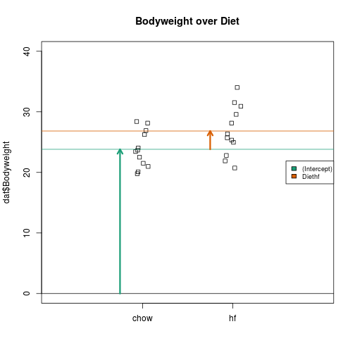

```r
url <- "https://raw.githubusercontent.com/genomicsclass/dagdata/master/inst/extdata/femaleMiceWeights.csv"
filename <- "femaleMiceWeights.csv"
library(downloader)
if (!file.exists(filename)) download(url, filename)
dat <- read.csv(filename)
stripchart(dat$Bodyweight ~ dat$Diet, vertical=TRUE, method="jitter",
           main="Bodyweight over Diet")
```

 

## A linear model with one variable


```r
levels(dat$Diet)
```

```
## [1] "chow" "hf"
```

```r
X <- model.matrix(~ Diet, data=dat)
X
```

```
##    (Intercept) Diethf
## 1            1      0
## 2            1      0
## 3            1      0
## 4            1      0
## 5            1      0
## 6            1      0
## 7            1      0
## 8            1      0
## 9            1      0
## 10           1      0
## 11           1      0
## 12           1      0
## 13           1      1
## 14           1      1
## 15           1      1
## 16           1      1
## 17           1      1
## 18           1      1
## 19           1      1
## 20           1      1
## 21           1      1
## 22           1      1
## 23           1      1
## 24           1      1
## attr(,"assign")
## [1] 0 1
## attr(,"contrasts")
## attr(,"contrasts")$Diet
## [1] "contr.treatment"
```

```r
colnames(X)
```

```
## [1] "(Intercept)" "Diethf"
```

```r
dat$Diet <- relevel(dat$Diet, ref="hf")
model.matrix(~ Diet, data=dat)
```

```
##    (Intercept) Dietchow
## 1            1        1
## 2            1        1
## 3            1        1
## 4            1        1
## 5            1        1
## 6            1        1
## 7            1        1
## 8            1        1
## 9            1        1
## 10           1        1
## 11           1        1
## 12           1        1
## 13           1        0
## 14           1        0
## 15           1        0
## 16           1        0
## 17           1        0
## 18           1        0
## 19           1        0
## 20           1        0
## 21           1        0
## 22           1        0
## 23           1        0
## 24           1        0
## attr(,"assign")
## [1] 0 1
## attr(,"contrasts")
## attr(,"contrasts")$Diet
## [1] "contr.treatment"
```

```r
dat$Diet <- relevel(dat$Diet, ref="chow")
```

## The mathematics behind lm()

$$ \hat{\beta} = (X^t X)^{-1} X^t y $$


```r
y <- dat$Bodyweight
X <- model.matrix(~ Diet, data=dat)
solve(t(X) %*% X) %*% t(X) %*% y
```

```
##                  [,1]
## (Intercept) 23.813333
## Diethf       3.020833
```


```r
s <- split(dat$Bodyweight, dat$Diet)
mean(s[["chow"]])
```

```
## [1] 23.81333
```

```r
mean(s[["hf"]]) - mean(s[["chow"]])
```

```
## [1] 3.020833
```


```r
fit <- lm(Bodyweight ~ Diet, data=dat)
summary(fit)
```

```
## 
## Call:
## lm(formula = Bodyweight ~ Diet, data = dat)
## 
## Residuals:
##     Min      1Q  Median      3Q     Max 
## -6.1042 -2.4358 -0.4138  2.8335  7.1858 
## 
## Coefficients:
##             Estimate Std. Error t value Pr(>|t|)    
## (Intercept)   23.813      1.039  22.912   <2e-16 ***
## Diethf         3.021      1.470   2.055   0.0519 .  
## ---
## Signif. codes:  0 '***' 0.001 '**' 0.01 '*' 0.05 '.' 0.1 ' ' 1
## 
## Residual standard error: 3.6 on 22 degrees of freedom
## Multiple R-squared:  0.1611,	Adjusted R-squared:  0.1229 
## F-statistic: 4.224 on 1 and 22 DF,  p-value: 0.05192
```

```r
(coefs <- coef(fit))
```

```
## (Intercept)      Diethf 
##   23.813333    3.020833
```

## Examining the coefficients


```r
stripchart(dat$Bodyweight ~ dat$Diet, vertical=TRUE, method="jitter",
           main="Bodyweight over Diet", ylim=c(0,40), xlim=c(0,3))
a <- -0.25
lgth <- .1
library(RColorBrewer)
cols <- brewer.pal(3,"Dark2")
abline(h=0)
arrows(1+a,0,1+a,coefs[1],lwd=3,col=cols[1],length=lgth)
abline(h=coefs[1],col=cols[1])
arrows(2+a,coefs[1],2+a,coefs[1]+coefs[2],lwd=3,col=cols[2],length=lgth)
abline(h=coefs[1]+coefs[2],col=cols[2])
legend("right",names(coefs),fill=cols,cex=.75,bg="white")
```

 

## Comparing simple two group to a t-test


```r
summary(fit)$coefficients
```

```
##              Estimate Std. Error   t value     Pr(>|t|)
## (Intercept) 23.813333   1.039353 22.911684 7.642256e-17
## Diethf       3.020833   1.469867  2.055174 5.192480e-02
```

```r
(ttest <- t.test(s[["chow"]], s[["hf"]], var.equal=TRUE))
```

```
## 
## 	Two Sample t-test
## 
## data:  s[["chow"]] and s[["hf"]]
## t = -2.0552, df = 22, p-value = 0.05192
## alternative hypothesis: true difference in means is not equal to 0
## 95 percent confidence interval:
##  -6.06915183  0.02748516
## sample estimates:
## mean of x mean of y 
##  23.81333  26.83417
```

```r
summary(fit)$coefficients[2,3]
```

```
## [1] 2.055174
```

```r
ttest$statistic
```

```
##         t 
## -2.055174
```

```r
t.test(s[["hf"]], s[["chow"]], var.equal=TRUE)$statistic
```

```
##        t 
## 2.055174
```

