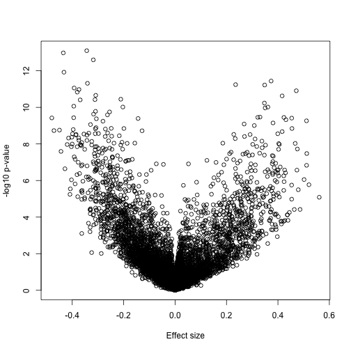
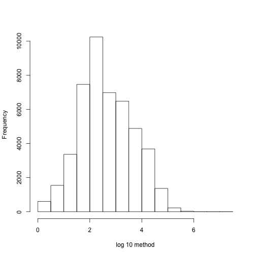
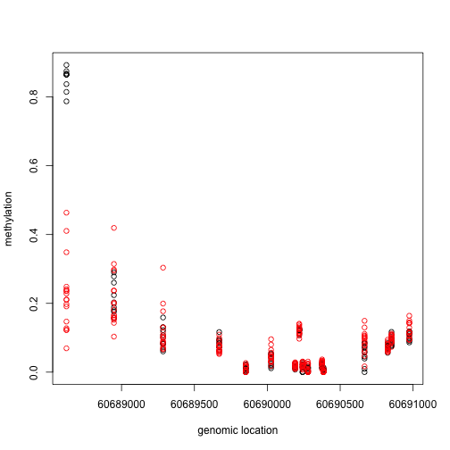
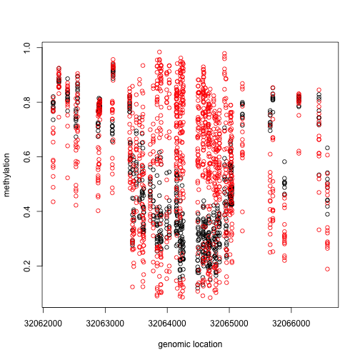
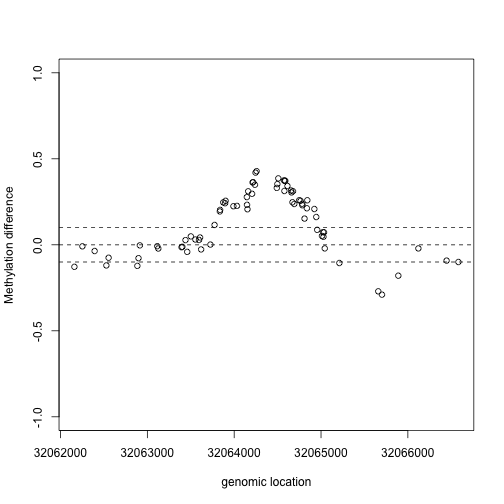
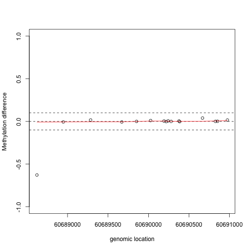
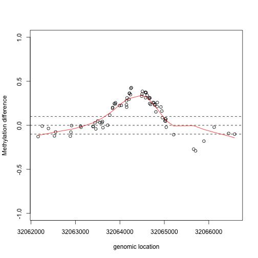
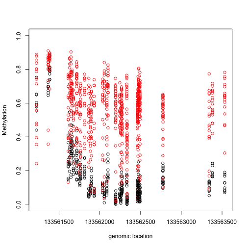
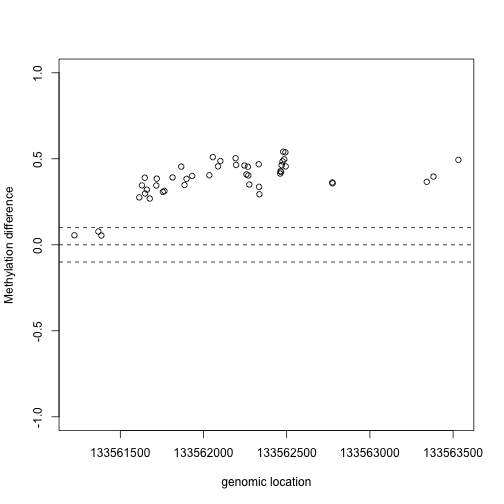

In this unit we will show an example of analyzing methylation data. We will use colon cancer data from TCGA. The data was created with the Illumina 450K array and we have already processed the raw data to create matrix with methylation measurements. The script that creates these ojects is here: https://github.com/genomicsclass/labs/blob/master/Rscripts/read_tcga_meth.R

Let's begin by loading the data

```r
# devtools::install_github('coloncancermeth','genomicsclass')
library(coloncancermeth)
data(coloncancermeth)
```


We know have three tables one containing the methylation data, one with information about the samples or columns of the data matrix, and granges object with the genomic location of the CpGs represetned in the rows of the data matrix


```r
dim(meth)  ##this is the methylation data
```

```
## [1] 485512     26
```

```r
dim(pd)  ##this is sample information
```

```
## NULL
```

```r
length(gr)
```

```
## [1] 1
```


The pd object includes clinical information. One the coluumns tells us if the sample is from colon cancer or from normal tissue


```r
colnames(pd)
```

```
## NULL
```

```r
table(pd$Status)
```

```
## Loading required package: IRanges
## Loading required package: methods
## Loading required package: BiocGenerics
## Loading required package: parallel
## 
## Attaching package: 'BiocGenerics'
## 
## The following objects are masked from 'package:parallel':
## 
##     clusterApply, clusterApplyLB, clusterCall, clusterEvalQ,
##     clusterExport, clusterMap, parApply, parCapply, parLapply,
##     parLapplyLB, parRapply, parSapply, parSapplyLB
## 
## The following object is masked from 'package:stats':
## 
##     xtabs
## 
## The following objects are masked from 'package:base':
## 
##     anyDuplicated, append, as.data.frame, as.vector, cbind,
##     colnames, do.call, duplicated, eval, evalq, Filter, Find, get,
##     intersect, is.unsorted, lapply, Map, mapply, match, mget,
##     order, paste, pmax, pmax.int, pmin, pmin.int, Position, rank,
##     rbind, Reduce, rep.int, rownames, sapply, setdiff, sort,
##     table, tapply, union, unique, unlist
```

```
## 
## normal cancer 
##      9     17
```

```r
normalIndex <- which(pd$Status == "normal")
cancerlIndex <- which(pd$Status == "cancer")
```


Let's start by taking a quick look at the distribution of methylation measurements for the normal samples


```r
i = normalIndex[1]
plot(density(meth[, i], from = 0, to = 1), main = "", ylim = c(0, 3), type = "n")
for (i in normalIndex) {
    lines(density(meth[, i], from = 0, to = 1), col = 1)
}
### Add the cancer samples
for (i in cancerlIndex) {
    lines(density(meth[, i], from = 0, to = 1), col = 2)
}
```

 


We are interested in finding regions of the genome that are different between cancer and normal samples. Furthermore, we want regions that are consistenly different therefore we can treat this as an inference problem. We can compute a t-statistic for each CpG


```r
library(limma)
```

```
## 
## Attaching package: 'limma'
## 
## The following object is masked from 'package:BiocGenerics':
## 
##     plotMA
```

```r
X <- model.matrix(~pd$Status)
fit <- lmFit(meth, X)
eb <- ebayes(fit)
```


A volcano plot reveals many differences


```r
library(rafalib)
```

```
## Loading required package: RColorBrewer
```

```r
splot(fit$coef[, 2], -log10(eb$p.value[, 2]), xlab = "Effect size", ylab = "-log10 p-value")
```

 


If we have reason to believe for DNA methylation to have an effect on gene expression a region of the genome needs to be affected, not just a single CpG, we should look beyond. Here is plot of the region surrounding the top hit


```r
i <- which.min(eb$p.value[, 2])
middle <- gr[i, ]
```

```
## Loading required package: GenomicRanges
## Loading required package: GenomeInfoDb
```

```
## Error: unable to find an inherited method for function '[' for signature
## '"GRanges"'
```

```r
Index <- gr %over% (middle + 10000)
```

```
## Error: error in evaluating the argument 'subject' in selecting a method for function 'overlapsAny': Error: object 'middle' not found
```

```r
cols = ifelse(pd$Status == "normal", 1, 2)
chr = as.factor(seqnames(gr))
pos = start(gr)

plot(pos[Index], fit$coef[Index, 2], type = "b", xlab = "genomic location", 
    ylab = "difference")
```

```
## Error: object 'Index' not found
```

```r
matplot(pos[Index], meth[Index, ], col = cols, xlab = "genomic location")
```

```
## Error: object 'Index' not found
```


We can search for these regions explicitely, instead of searching for single points as explained by Jaffe and Irizarry (2012) [http://www.ncbi.nlm.nih.gov/pubmed/22422453]. 

If we are going to perform regional analysis we first have to define a region. But one issue is that not only do we have to separate the analysis by chromosome but that within each chromosome we usually have big gaps creating subgroups of regions to be analyzed.


```r
chr1Index <- which(chr == "chr1")
hist(log10(diff(pos[chr1Index])), main = "", xlab = "log 10 method")
```

 


We can create groups in the following way.


```r
# biocLite('bumphunter')
library(bumphunter)
```

```
## Loading required package: foreach
## Loading required package: iterators
## Loading required package: locfit
## locfit 1.5-9.1 	 2013-03-22
```

```r
cl = clusterMaker(chr, pos, maxGap = 500)
table(table(cl))  ##shows the number of regions with 1,2,3, ... points in them
```

```
## 
##      1      2      3      4      5      6      7      8      9     10 
## 141457  18071  13227   6473   5144   3748   2517   2135   2029   1878 
##     11     12     13     14     15     16     17     18     19     20 
##   1792   1570   1269    933    684    472    337    240    181     99 
##     21     22     23     24     25     26     27     28     29     30 
##    113     62     57     42     36     39     26     17     21     19 
##     31     32     33     34     35     36     37     38     39     40 
##     12     12     12      7      7     12      3      9      4      5 
##     41     42     43     44     45     46     48     49     50     51 
##      7      7      9      7      7      8      3      5      5      2 
##     52     53     54     55     56     57     58     59     60     61 
##      1      5      2      4      1      1      3      2      1      4 
##     62     63     64     65     67     68     70     71     73     74 
##      3      4      1      2      2      1      2      1      2      2 
##     76     78     80     82     83     85     87     88     89     90 
##      2      1      3      2      1      2      1      2      1      1 
##     91     92     93    112    117    137    141    181 
##      1      1      1      2      1      1      1      1
```


Now let's consider two example regions


```r
### Select the region with the smallest value
Index <- which(cl == cl[which.min(fit$coef[, 2])])
matplot(pos[Index], meth[Index, ], col = cols, pch = 1, xlab = "genomic location", 
    ylab = "methylation")
```

 

```r

x1 = pos[Index]
y1 = fit$coef[Index, 2]
plot(x1, y1, xlab = "genomic location", ylab = "Methylation difference", ylim = c(-1, 
    1))
abline(h = 0, lty = 2)
abline(h = c(-0.1, 0.1), lty = 2)
```

 


This region shows only a single CpG as different. In contrast notice this region:


```r
Index = which(cl == 72201)  ##we know this is a good example from analysis we have already performed

matplot(pos[Index], meth[Index, ], col = cols, pch = 1, xlab = "genomic location", 
    ylab = "methylation")
```

 

```r

x2 = pos[Index]
y2 = fit$coef[Index, 2]
plot(x2, y2, xlab = "genomic location", ylab = "Methylation difference", ylim = c(-1, 
    1))
abline(h = 0, lty = 2)
abline(h = c(-0.1, 0.1), lty = 2)
```

 


If we are interested in prioritizing regions over single points, we need an alternative approach. If we assume that the real signal is smooth, we could use statistical smoothing techniques such as loess. Here is an example two regions above


```r
lfit <- loess(y1 ~ x1, degree = 1, family = "symmetric", span = 1/2)
plot(x1, y1, xlab = "genomic location", ylab = "Methylation difference", ylim = c(-1, 
    1))
abline(h = c(-0.1, 0, 0.1), lty = 2)
lines(x1, lfit$fitted, col = 2)
```

 

```r

lfit <- loess(y2 ~ x2, degree = 1, family = "symmetric", span = 1/2)
plot(x2, y2, xlab = "genomic location", ylab = "Methylation difference", ylim = c(-1, 
    1))
abline(h = c(-0.1, 0, 0.1), lty = 2)
lines(x2, lfit$fitted, col = 2)
```

 


The bumphunter automates this procedure


```r
res <- bumphunter(meth, X, chr = chr, pos = pos, cluster = cl, cutoff = 0.1, 
    B = 0)
```

```
## [bumphunterEngine] Using a single core (backend: doSEQ, version: 1.4.2).
## [bumphunterEngine] Computing coefficients.
## [bumphunterEngine] Finding regions.
## [bumphunterEngine] Found 68682 bumps.
```

```r
tab <- res$table
```


We now have a list of regions instead of single points. Here we look at the region with the highest rank if we order by area


```r
Index = (tab[1, 7] - 3):(tab[1, 8] + 3)
matplot(pos[Index], meth[Index, , drop = TRUE], col = cols, pch = 1, xlab = "genomic location", 
    ylab = "Methylation", ylim = c(0, 1))
```

 

```r
plot(pos[Index], res$fitted[Index, 1], xlab = "genomic location", ylab = "Methylation difference", 
    ylim = c(-1, 1))
abline(h = c(-0.1, 0, 0.1), lty = 2)
```

 


The function also allows from smoothing and permutation based inference for the regions. However, we do not recommend running the function with these options without the ability to parallelize. 

