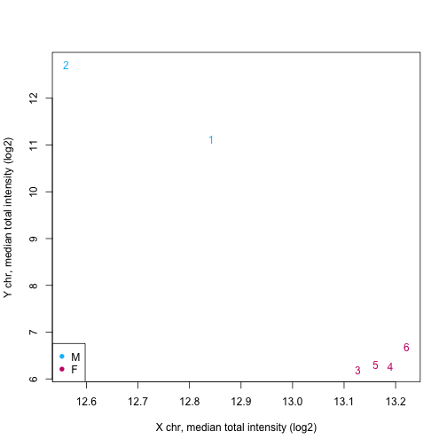
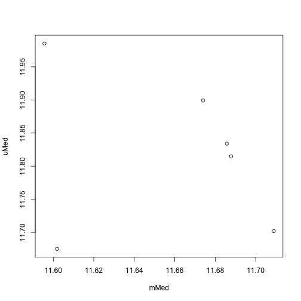

In this unit we will demonstrate how to read idat files from the illumina 450K DNA methylation array. We make use the the Bioconductor minfi package [cite 24478339]


```r
# source('http://www.bioconductor.org/biocLite.R')
# biocLite(c('minfi','IlluminaHumanMethylation450kmanifest','IlluminaHumanMethylation450kanno.ilmn12.hg19'))
library(minfi)
```

```
## Loading required package: methods
## Loading required package: BiocGenerics
## Loading required package: parallel
## 
## Attaching package: 'BiocGenerics'
## 
## The following objects are masked from 'package:parallel':
## 
##     clusterApply, clusterApplyLB, clusterCall, clusterEvalQ,
##     clusterExport, clusterMap, parApply, parCapply, parLapply,
##     parLapplyLB, parRapply, parSapply, parSapplyLB
## 
## The following object is masked from 'package:stats':
## 
##     xtabs
## 
## The following objects are masked from 'package:base':
## 
##     anyDuplicated, append, as.data.frame, as.vector, cbind,
##     colnames, do.call, duplicated, eval, evalq, Filter, Find, get,
##     intersect, is.unsorted, lapply, Map, mapply, match, mget,
##     order, paste, pmax, pmax.int, pmin, pmin.int, Position, rank,
##     rbind, Reduce, rep.int, rownames, sapply, setdiff, sort,
##     table, tapply, union, unique, unlist
## 
## Loading required package: Biobase
## Welcome to Bioconductor
## 
##     Vignettes contain introductory material; view with
##     'browseVignettes()'. To cite Bioconductor, see
##     'citation("Biobase")', and for packages 'citation("pkgname")'.
## 
## Loading required package: lattice
## Loading required package: GenomicRanges
## Loading required package: IRanges
## Loading required package: GenomeInfoDb
## Loading required package: Biostrings
## Loading required package: XVector
## Loading required package: bumphunter
## Loading required package: foreach
## Loading required package: iterators
## Loading required package: locfit
## locfit 1.5-9.1 	 2013-03-22
```


The first step is to determine the basename of the idat files. Note that for each sample we have two files: one for red and green channels respectively. These files are found here: <https://github.com/genomicsclass/rawdata/tree/master/idats>


```r
path <- "idats"
list.files(path)
```

```
##  [1] "5775041065_R01C02_Grn.idat" "5775041065_R01C02_Red.idat"
##  [3] "5775041065_R04C01_Grn.idat" "5775041065_R04C01_Red.idat"
##  [5] "5775041068_R01C02_Grn.idat" "5775041068_R01C02_Red.idat"
##  [7] "5775041068_R04C01_Grn.idat" "5775041068_R04C01_Red.idat"
##  [9] "5775041068_R06C01_Grn.idat" "5775041068_R06C01_Red.idat"
## [11] "5775041084_R01C01_Grn.idat" "5775041084_R01C01_Red.idat"
## [13] "targets.csv"
```


Let's start by reading in the csv file which contains clinical information. This has one row for each sample and one of the columns includes the "basenames" for the files


```r
targets <- read.csv("idats/targets.csv", as.is = TRUE)
names(targets)
```

```
##   [1] "X"                                                                
##   [2] "bcr_patient_barcode"                                              
##   [3] "bcr_sample_uuid"                                                  
##   [4] "bcr_sample_barcode"                                               
##   [5] "NCNNCT_OthMethONSP"                                               
##   [6] "current_weight"                                                   
##   [7] "days_to_collection"                                               
##   [8] "days_to_sample_procurement"                                       
##   [9] "freezing_method"                                                  
##  [10] "initial_weight"                                                   
##  [11] "intermediate_dimension"                                           
##  [12] "longest_dimension"                                                
##  [13] "lymphatic_invasion"                                               
##  [14] "margins_involved"                                                 
##  [15] "method_of_sample_procurement"                                     
##  [16] "number_regional_lymphnodes_exam"                                  
##  [17] "number_regional_lymphnodes_pos"                                   
##  [18] "oct_embedded"                                                     
##  [19] "pathology_report_uuid"                                            
##  [20] "primary_or_metastatic_status"                                     
##  [21] "sample_type"                                                      
##  [22] "sample_type_id"                                                   
##  [23] "shortest_dimension"                                               
##  [24] "time_between_clamping_and_freezing"                               
##  [25] "time_between_excision_and_freezing"                               
##  [26] "venous_invasion"                                                  
##  [27] "verification_by_bcr"                                              
##  [28] "vial_number.sample"                                               
##  [29] "bcr_patient_barcode.tumor"                                        
##  [30] "tumor_necrosis_percent"                                           
##  [31] "tumor_nuclei_percent"                                             
##  [32] "tumor_weight"                                                     
##  [33] "vial_number.tumor"                                                
##  [34] "bcr_patient_barcode.normal"                                       
##  [35] "days_to_normal_sample_procurement"                                
##  [36] "method_of_normal_sample_procurement"                              
##  [37] "normal_control_type"                                              
##  [38] "normal_tissue_anatomic_site"                                      
##  [39] "normal_tissue_proximity"                                          
##  [40] "vial_number"                                                      
##  [41] "ncedna_dna_conc"                                                  
##  [42] "ncedna_dna_qm"                                                    
##  [43] "ncedna_dna_qty"                                                   
##  [44] "ncedna_dna_vol"                                                   
##  [45] "patient.age_at_initial_pathologic_diagnosis"                      
##  [46] "patient.ajcc_cancer_staging_handbook_edition"                     
##  [47] "patient.anatomic_organ_subdivision"                               
##  [48] "patient.anatomic_site_colorectal"                                 
##  [49] "patient.bcr_patient_uuid"                                         
##  [50] "patient.braf_gene_analysis_performed"                             
##  [51] "patient.braf_gene_analysis_result"                                
##  [52] "patient.circumferential_resection_margin"                         
##  [53] "patient.colon_polyps_present"                                     
##  [54] "patient.date_of_form_completion"                                  
##  [55] "patient.date_of_initial_pathologic_diagnosis"                     
##  [56] "patient.days_to_birth"                                            
##  [57] "patient.days_to_death"                                            
##  [58] "patient.days_to_initial_pathologic_diagnosis"                     
##  [59] "patient.days_to_last_followup"                                    
##  [60] "patient.days_to_last_known_alive"                                 
##  [61] "patient.distant_metastasis_pathologic_spread"                     
##  [62] "patient.ethnicity"                                                
##  [63] "patient.gender"                                                   
##  [64] "patient.height"                                                   
##  [65] "patient.histological_type"                                        
##  [66] "patient.history_of_colon_polyps"                                  
##  [67] "patient.icd_10"                                                   
##  [68] "patient.icd_o_3_histology"                                        
##  [69] "patient.icd_o_3_site"                                             
##  [70] "patient.informed_consent_verified"                                
##  [71] "patient.kras_gene_analysis_performed"                             
##  [72] "patient.kras_mutation_codon"                                      
##  [73] "patient.kras_mutation_found"                                      
##  [74] "patient.loss_expression_of_mismatch_repair_proteins_by_ihc"       
##  [75] "patient.loss_expression_of_mismatch_repair_proteins_by_ihc_result"
##  [76] "patient.lymph_node_examined_count"                                
##  [77] "patient.lymphatic_invasion"                                       
##  [78] "patient.lymphnode_pathologic_spread"                              
##  [79] "patient.microsatellite_instability"                               
##  [80] "patient.non_nodal_tumor_deposits"                                 
##  [81] "patient.number_of_abnormal_loci"                                  
##  [82] "patient.number_of_first_degree_relatives_with_cancer_diagnosis"   
##  [83] "patient.number_of_loci_tested"                                    
##  [84] "patient.number_of_lymphnodes_positive_by_he"                      
##  [85] "patient.number_of_lymphnodes_positive_by_ihc"                     
##  [86] "patient.patient_id"                                               
##  [87] "patient.perineural_invasion_present"                              
##  [88] "patient.person_neoplasm_cancer_status"                            
##  [89] "patient.preoperative_pretreatment_cea_level"                      
##  [90] "patient.pretreatment_history"                                     
##  [91] "patient.primary_lymph_node_presentation_assessment"               
##  [92] "patient.primary_tumor_pathologic_spread"                          
##  [93] "patient.prior_diagnosis"                                          
##  [94] "patient.race"                                                     
##  [95] "patient.residual_tumor"                                           
##  [96] "patient.synchronous_colon_cancer_present"                         
##  [97] "patient.tissue_source_site"                                       
##  [98] "patient.tumor_stage"                                              
##  [99] "patient.tumor_tissue_site"                                        
## [100] "patient.venous_invasion"                                          
## [101] "patient.vital_status"                                             
## [102] "patient.weight"                                                   
## [103] "Basename"                                                         
## [104] "Status"                                                           
## [105] "Tissue"                                                           
## [106] "Sex"
```

```r
targets$Basename
```

```
## [1] "5775041065_R01C02" "5775041068_R01C02" "5775041065_R04C01"
## [4] "5775041068_R04C01" "5775041068_R06C01" "5775041084_R01C01"
```


To make this script work in any working directory  we can edit that column to contain the absolute paths. The we are ready to read in the raw data with read.450k


```r
targets$Basename <- file.path(path, targets$Basename)
rgset <- read.450k(targets$Basename, verbose = TRUE)
```

```
## [read.450k] Reading 5775041065_R01C02_Grn.idat 
## [read.450k] Reading 5775041068_R01C02_Grn.idat 
## [read.450k] Reading 5775041065_R04C01_Grn.idat 
## [read.450k] Reading 5775041068_R04C01_Grn.idat 
## [read.450k] Reading 5775041068_R06C01_Grn.idat 
## [read.450k] Reading 5775041084_R01C01_Grn.idat 
## [read.450k] Reading 5775041065_R01C02_Red.idat 
## [read.450k] Reading 5775041068_R01C02_Red.idat 
## [read.450k] Reading 5775041065_R04C01_Red.idat 
## [read.450k] Reading 5775041068_R04C01_Red.idat 
## [read.450k] Reading 5775041068_R06C01_Red.idat 
## [read.450k] Reading 5775041084_R01C01_Red.idat 
## [read.450k] Read idat files in  15.4 seconds
## [read.450k] Creating data matrices ... done in 1.967 seconds
## [read.450k] Instantiating final object ... done in 3.99 seconds
```

```r
pData(rgset) <- targets
```


We now have the raw data, red an green intensities which we have access too

```r
dim(getRed(rgset))
```

```
## [1] 622399      6
```

```r
dim(getGreen(rgset))
```

```
## [1] 622399      6
```


If you are not interested in developing preprocessing algorithms then you can use the built in preprocessing algorithmg and go straight to object that give you access to methylation esimatates 


```r
mset <- preprocessIllumina(rgset)
```

```
## Loading required package: IlluminaHumanMethylation450kmanifest
```


This performs the default preprocessing algorithm developed by Illumina. However, for this to be useful we want to have the locations of each CpG and to do that we need map the CpGs to genome. Minfi keeps this information modular so that when the genome annotation gets updated one can easilty change the mapping. 

```r
mset <- mapToGenome(mset)
```

```
## Loading required package: IlluminaHumanMethylation450kanno.ilmn12.hg19
```


Now we are ready to obtain the methylation values and CpG locations.
 

```r
dim(getBeta(mset, type = "Illumina"))  ##the argument type='Illumina' gives us default procedure
```

```
## [1] 485512      6
```

```r
head(granges(mset))
```

```
## GRanges with 6 ranges and 0 metadata columns:
##              seqnames         ranges strand
##                 <Rle>      <IRanges>  <Rle>
##   cg13869341     chr1 [15865, 15865]      *
##   cg14008030     chr1 [18827, 18827]      *
##   cg12045430     chr1 [29407, 29407]      *
##   cg20826792     chr1 [29425, 29425]      *
##   cg00381604     chr1 [29435, 29435]      *
##   cg20253340     chr1 [68849, 68849]      *
##   ---
##   seqlengths:
##     chr1  chr2  chr3  chr4  chr5  chr6 ... chr20 chr21 chr22  chrX  chrY
##       NA    NA    NA    NA    NA    NA ...    NA    NA    NA    NA    NA
```


We can also use functions such as getSex and getQC on the mset object

```r
sex <- getSex(mset)
plotSex(sex)
```

 

```r
plot(as.matrix(getQC(mset)))
```

 

