The following code reproduces the images in the Multiple testing lecture.


First we make a function for drawing sections of a uniform distribution.


```r
drawU <- function(a, y, boxes = FALSE, xmax = 1) {
    plot(1, 1, type = "n", xlim = c(0, xmax), ylim = c(0, 1.2 * y), bty = "L", 
        xlab = "p", ylab = "", las = 1)
    lines(c(0, 1, 1, 0, 0), c(0, 0, y, y, 0))
    polygon(c(0, a, a, 0), c(0, 0, y, y), col = rgb(1, 0, 0, 0.5))
    polygon(c(a, 1, 1, a), c(0, 0, y, y), col = rgb(0, 0, 0, 0.1))
    x <- 1/a
    if (boxes) {
        segments(0:x/x, 0, 0:x/x, y)
    }
}
```


Here we draw a uniform distribution, and show how many p-values we expect at different cutoffs.


```r
drawU(0.3, 1)
```

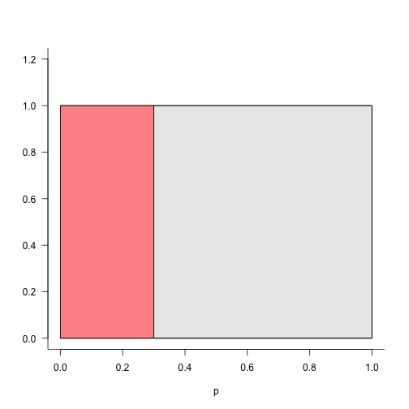 

```r
drawU(1/20, 1)
```

 

```r
drawU(1/20, 20000/20, TRUE)
```

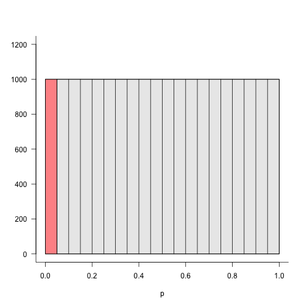 

```r
drawU(1/100, 20000/100, TRUE)
```

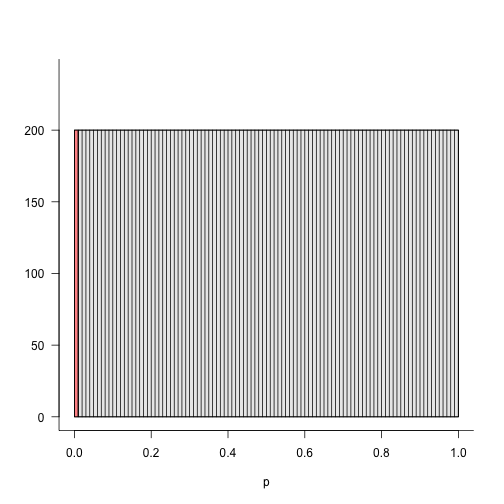 

```r
drawU(1/1000, 20000/1000, TRUE, 0.01)
```

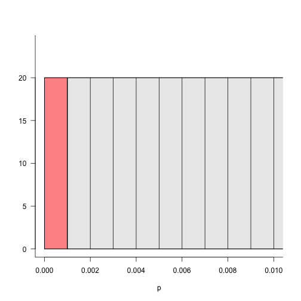 


The distribution of p-values using a z-score.


```r
z <- rnorm(100)
brks <- 0:20/20
hist(pnorm(z), col = "grey", main = "", xlab = "p", breaks = brks)
```

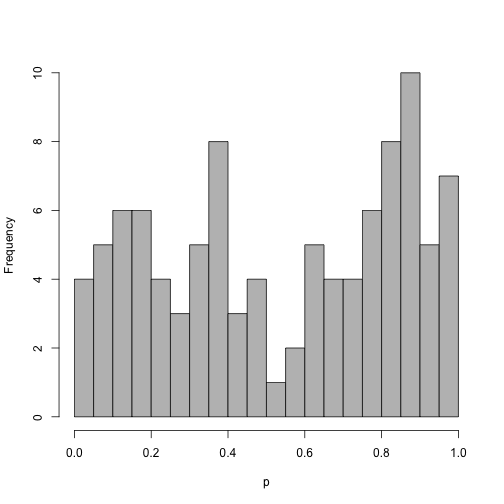 


The same as above, but with now many more z-scores. Now the distribution looks more uniform.


```r
z <- rnorm(10000)
hist(pnorm(z), col = "grey", main = "", xlab = "p", breaks = brks)
```

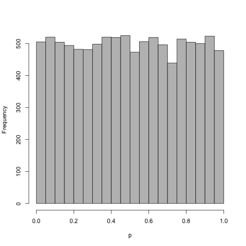 


What happens if we spike in 500 small z-scores?


```r
z <- c(rnorm(10000), rep(-3.72, 500))
h <- hist(pnorm(z), col = "grey", main = "", xlab = "p", breaks = brks)
abline(h = 10000/20, col = "red", lwd = 4, lty = 3)
abline(h = h$counts[1], col = "blue", lwd = 4, lty = 3)
```

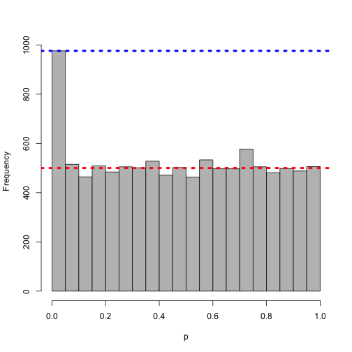 


Now, making the bins in the histogram smaller, i.e. looking for a smaller p-value threshold:


```r
h <- hist(pnorm(z), col = "grey", main = "", xlab = "p", breaks = 0:50/50)
abline(h = 10000/50, col = "red", lwd = 4, lty = 3)
abline(h = h$counts[1], col = "blue", lwd = 4, lty = 3)
```

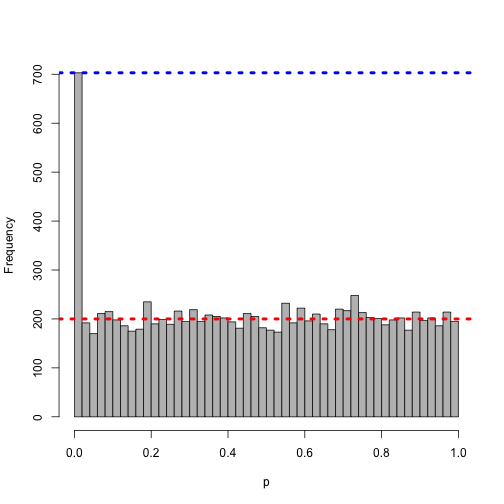 


Even smaller...


```r
h <- hist(pnorm(z), col = "grey", main = "", xlab = "p", breaks = 0:100/100)
abline(h = 10000/100, col = "red", lwd = 4, lty = 3)
abline(h = h$counts[1], col = "blue", lwd = 4, lty = 3)
```

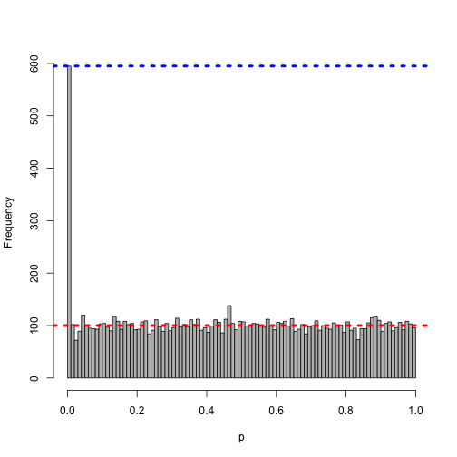 


Even smaller...


```r
h <- hist(pnorm(z), col = "grey", main = "", xlab = "p", breaks = 0:10000/10000)
abline(h = 10000/10000, col = "red", lwd = 4, lty = 3)
abline(h = sum(h$counts[1]), col = "blue", lwd = 4, lty = 3)
```

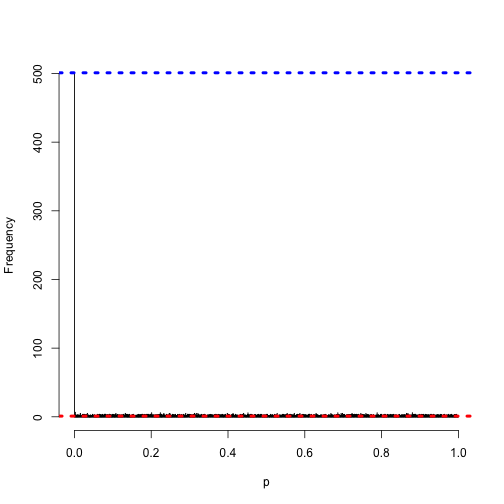 


This visualizes the [Benjamini Hochberg method](#foot).


```r
set.seed(1)
pvals <- c(runif(90), runif(10, 0, 0.001))
plot(sort(pvals), xlab = "i", ylab = "p-value", ylim = c(0, 1))
abline(0, 0.05/length(pvals))
legend("top", expression(slope ~ alpha/m))
```

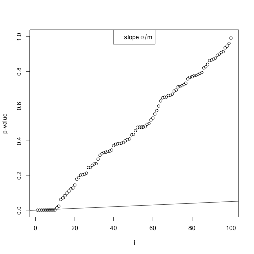 


```r
plot(sort(pvals), xlab = "i", ylab = "p-value", ylim = c(0, 0.03), xlim = c(0, 
    13))
abline(0, 0.05/length(pvals))
legend("top", expression(slope ~ alpha/m))
```

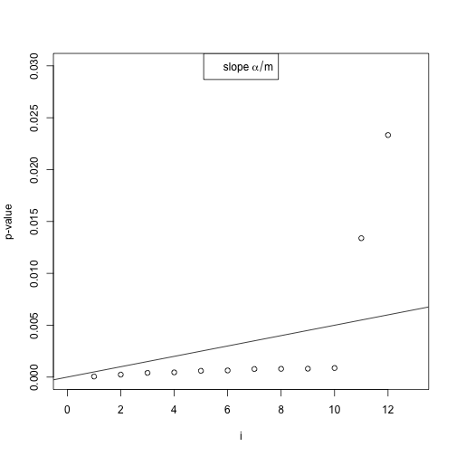 


## Footnotes <a name="foot"></a>

Yoav Benjamini and Yosef Hochberg, "Controlling the False Discovery Rate: A Practical and Powerful Approach to Multiple Testing". Journal of the Royal Statistical Society. 1995.
<http://www.jstor.org/discover/10.2307/2346101>
