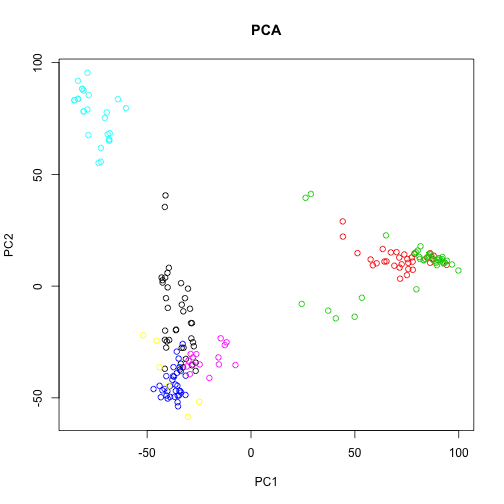
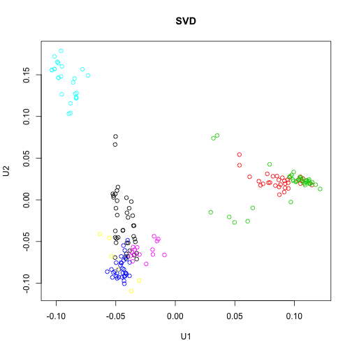
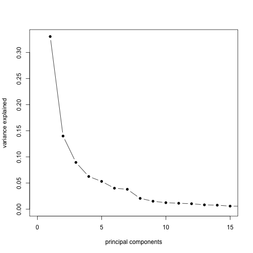
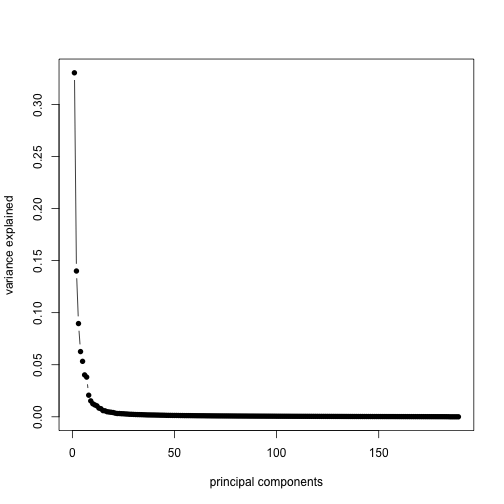
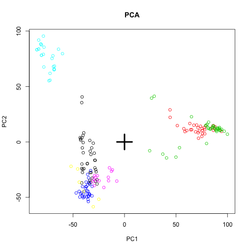
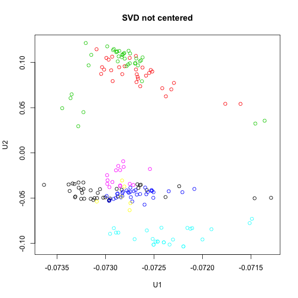
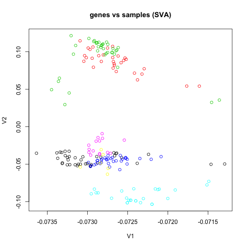

In this unit, we will show how to perform principal component analysis (PCA) and singular value decomposition (SVD) in R, and how the two are related to each other. We will use the tissue gene expression dataset from the week 5 lectures and labs.


```r
# library(devtools) install_github('dagdata','genomicsclass')
library(dagdata)
data(tissuesGeneExpression)
library(rafalib)
```

```
## Loading required package: RColorBrewer
```

```r
group <- as.fumeric(tab$Tissue)
```


First, the typical principal component analysis on the samples would be to transpose the data such that the samples are rows of the data matrix. The `prcomp` function can be used to return the principal components and other variables.


```r
x <- t(e)
pc <- prcomp(x)
# ?prcomp
names(pc)
```

```
## [1] "sdev"     "rotation" "center"   "scale"    "x"
```

```r
plot(pc$x[, 1], pc$x[, 2], col = group, main = "PCA", xlab = "PC1", ylab = "PC2")
```

 


This PCA is equivalent to performing the SVD on the centered data, where the centering occurs on the columns (here genes). We can use the `sweep` function to perform arbitrary operations on the rows and columns of a matrix. The second argument specifies we want to operate on the columns (1 would be used for rows), and the third and fourth arguments specify that we want to subtract the column means.


```r
cx <- sweep(x, 2, colMeans(x), "-")
sv <- svd(cx)
names(sv)
```

```
## [1] "d" "u" "v"
```

```r
plot(sv$u[, 1], sv$u[, 2], col = group, main = "SVD", xlab = "U1", ylab = "U2")
```

 


So the columns of U from the SVD correspond to the principal components `x` in the PCA. Furthermore, the matrix V from the SVD is equivalent to the `rotation` matrix returned by `prcomp`.


```r
sv$v[1:5, 1:5]
```

```
##            [,1]      [,2]      [,3]      [,4]       [,5]
## [1,]  0.0046966 -0.013275  0.002087  0.017093  0.0006956
## [2,] -0.0021623 -0.002212  0.001543 -0.003346 -0.0034159
## [3,] -0.0030945  0.005870  0.001686  0.003890  0.0019032
## [4,] -0.0007355 -0.002002 -0.002753  0.001776  0.0192205
## [5,]  0.0010133  0.001215 -0.001561  0.003349 -0.0012380
```

```r
pc$rotation[1:5, 1:5]
```

```
##                  PC1       PC2       PC3       PC4        PC5
## 1007_s_at  0.0046966 -0.013275  0.002087  0.017093  0.0006956
## 1053_at   -0.0021623 -0.002212  0.001543 -0.003346 -0.0034159
## 117_at    -0.0030945  0.005870  0.001686  0.003890  0.0019032
## 121_at    -0.0007355 -0.002002 -0.002753  0.001776  0.0192205
## 1255_g_at  0.0010133  0.001215 -0.001561  0.003349 -0.0012380
```


The diagonal elements of D from the SVD are proportional to the standard deviations returned by PCA. The difference is that the standard deviations from `prcomp` are sample standard deviations (`prcomp` returns unbiased estimates of sample variance, so with the $n / (n - 1)$ correction). The elements of D are formed by taking the sum of the squares of the principal components but not dividing by the sample size.


```r
head(sv$d^2)
```

```
## [1] 673418 285393 182527 127667 108576  81999
```

```r
head(pc$sdev^2)
```

```
## [1] 3582.0 1518.0  970.9  679.1  577.5  436.2
```

```r
head(sv$d^2/(ncol(e) - 1))
```

```
## [1] 3582.0 1518.0  970.9  679.1  577.5  436.2
```


By dividing the variances by the sum, we get a plot of the ratio of variance explained by each principal component.


```r
plot(sv$d^2/sum(sv$d^2), xlim = c(0, 15), type = "b", pch = 16, xlab = "principal components", 
    ylab = "variance explained")
```

 

```r
plot(sv$d^2/sum(sv$d^2), type = "b", pch = 16, xlab = "principal components", 
    ylab = "variance explained")
```

 


Note that, not centering the data before running `svd` results in a slightly different plot:


```r
svNoCenter <- svd(x)
plot(pc$x[, 1], pc$x[, 2], col = group, main = "PCA", xlab = "PC1", ylab = "PC2")
points(0, 0, pch = 3, cex = 4, lwd = 4)
```

 

```r
plot(svNoCenter$u[, 1], svNoCenter$u[, 2], col = group, main = "SVD not centered", 
    xlab = "U1", ylab = "U2")
```

 


# SVD on (genes vs samples) and (samples vs genes)

Finally, we show that the SVD on the data matrix where samples are columns -- as used in the Surrogate Variable Analysis SVA -- is equivalent to the SVD on the data matrix where the samples are rows, if no centering has been done. 


```r
sv2 <- svd(t(e))
plot(sv2$u[, 1], sv2$u[, 2], col = group, main = "samples vs genes (typical PCA)", 
    xlab = "U1", ylab = "U2")
```

 

```r
sv1 <- svd(e)
plot(sv1$v[, 1], sv1$v[, 2], col = group, main = "genes vs samples (SVA)", xlab = "V1", 
    ylab = "V2")
```

 


The question of which direction to center depends on what the focus of the analysis is. For comparing sample distances, as in the typical PCA plot, the rows are samples and the genes are centered. For finding genes which contribute to batch, as in the SVA model, the rows are genes and the samples are centered.


