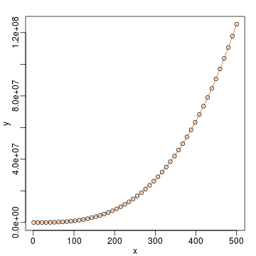

# Introduction

We have seen that to calculate the LSE we need to invert a marix. We have shown how to use solve. It turns out that solve is not a stable solution. When coding LSE computation we use the QR decomposition.


# Inverting $$\mathbf{X^\top X}$$


To miminize the RSS: 

$$
(\mathbf{Y}-\mathbf{X}\boldsymbol{\beta})^\top
(\mathbf{Y}-\mathbf{X}\boldsymbol{\beta})
$$

We need to solve:

$$
\mathbf{X}^\top \mathbf{X} \boldsymbol{\hat{\beta}} = \mathbf{X}^\top \mathbf{Y}   
$$

The solution is: 

$$
\boldsymbol{\hat{\beta}} = (\mathbf{X}^\top \mathbf{X})^{-1} \mathbf{X}^\top \mathbf{Y}   
$$

Thus  we need to compute $$(\mathbf{X}^\top \mathbf{X})^{-1}$$

# `solve` is unstable

Here we construct an extreme case 

```r
n <- 50;M <- 500
x <- seq(1,M,len=n)
X <- cbind(1,x,x^2,x^3)
beta <- matrix(c(1,1,1,1),4,1)
y <- X%*%beta+rnorm(n,sd=1)
```

The standard R function for inverse gives an error:

```r
solve(crossprod(X)) %*% crossprod(X,y)
```

To see why this happens look at $$(\mathbf{X}^\top \mathbf{X})$$


```r
log10(crossprod(X))
```

```
##          x          
##   1.7  4.1  6.6  9.2
## x 4.1  6.6  9.2 11.8
##   6.6  9.2 11.8 14.4
##   9.2 11.8 14.4 17.1
```

Note the difference of several orders of magnitude. On a digitial computer we have a limited range of numbers which makes some numbers seem like 0 which leads to division by 0 errors.

# The QR Factorization 

The QR factorization is based on a mathematical result that tells us that for a full rank $$N\times p$$ matrix $$\mathbf{X}$$ we can decompose as

$$
\mathbf{X = QR}
$$

with 

* $$\mathbf{Q}$$ a $$N \times p$$ matrix with  $$\mathbf{Q^\top Q=I}$$
* $$\mathbf{R}$$ a $$p \times p$$ upper triangular matrix.

Upper triangular matrices are very convinient for solving system of equations.

## Example of Upper Triangular Matrix

In the example below, the matrix on the left is upper triangular: It only has 0s below the diagonal.
Note that this facilitates solving the system of equations greatly:

$$\begin{pmatrix}
1&2&-1\\
0&1&2\\
0&0&1\\
\end{pmatrix}
\begin{pmatrix}
a\\
b\\
c\\
\end{pmatrix}
=
\begin{pmatrix}
6\\
4\\
1\\
\end{pmatrix}
$$

We immediately know that $$c=1$$ which implies that $$b+2=4$$ which implies  $$b=2$$ and thuse $$a+4-1=6$$ so $$a = 3$$. Writing an algorithm to do this is straigh-forward for any upper triangular matrix.

# Finding LSE with QR 

If we rewrite the equations of the LSE using $$\mathbf{QR}$$ instead of $$\mathbf{X}$$ we have:

$$\mathbf{X}^\top \mathbf{X} \boldsymbol{\beta} = \mathbf{X}^\top \mathbf{Y}$$

$$(\mathbf{Q}\mathbf{R})^\top (\mathbf{Q}\mathbf{R}) \boldsymbol{\beta} = (\mathbf{Q}\mathbf{R})^\top \mathbf{Y}$$

$$\mathbf{R}^\top (\mathbf{Q}^\top \mathbf{Q}) \mathbf{R} \boldsymbol{\beta} = \mathbf{R}^\top \mathbf{Q}^\top \mathbf{Y}$$

$$\mathbf{R}^\top \mathbf{R} \boldsymbol{\beta} = \mathbf{R}^\top \mathbf{Q}^\top \mathbf{Y}$$

$$(\mathbf{R}^\top)^{-1} \mathbf{R}^\top \mathbf{R} \boldsymbol{\beta} = (\mathbf{R}^\top)^{-1} \mathbf{R}^\top \mathbf{Q}^\top \mathbf{Y}$$

$$\mathbf{R} \boldsymbol{\beta} = \mathbf{Q}^\top \mathbf{Y}$$

$$\mathbf{R}$$ being upper triangular makes solving this more stable. Also beacuse $$\mathbf{Q}^\top\mathbf{Q}=\mathbf{I}$$ we know that the columns of $$\mathbf{Q}$$ are in the same scale which stabilizes the right side. 

Now we are ready to find LSE using the QR decomposition. To solve 

$$\mathbf{R} \boldsymbol{\beta} = \mathbf{Q}^\top \mathbf{Y}$$

We use `backsolve` which takes advantage of the upper triangular nature of $$\mathbf{R}$$.

```r
QR <- qr(X)
Q <- qr.Q( QR )
R <- qr.R( QR )
betahat <- backsolve(R, crossprod(Q,y) ) 
```

Note that in practice we do not need to do any of this due to the built in `solve.qr` function:


```r
QR <- qr(X)
betahat <- solve.qr(QR, y)
```


# Fitted values

This factorization also simplifies the calculation for fitted values:

$$\mathbf{X}\boldsymbol{\hat{\beta}} = 
(\mathbf{QR})\mathbf{R}^{-1}\mathbf{Q}^\top \mathbf{y}= \mathbf{Q}\mathbf{Q}^\top\mathbf{y} $$

In R we simply do the following:


```r
library(rafalib)
```

```
## Loading required package: RColorBrewer
```

```r
mypar(1,1)
plot(x,y)
fitted <- tcrossprod(Q)%*%y
lines(x,fitted,col=2)
```



# Standard Errors

To obtain the standard errors of the LSE we note that

$$(\mathbf{X^\top X})^{-1} = (\mathbf{R^\top Q^\top QR})^{-1} = (\mathbf{R^\top R})^{-1}$$

The function `chol2inv` is specifically designed to find this inverse. So all we do is the following


```r
df <- length(y)-QR$rank
sigma2 <- sum((y-fitted)^2)/df
var <- sigma2*chol2inv(QR$qr)
SE <- sqrt(diag(var))
cbind(betahat,SE)
```

```
##             SE
##   1.46 5.2e-01
## x 0.99 9.1e-03
##   1.00 4.3e-05
##   1.00 5.6e-08
```

Note that this gives us identical results to the `lm` function.


```r
summary(lm(y~0+X))$coef
```

```
##    Estimate Std. Error t value Pr(>|t|)
## X      1.46    5.2e-01 2.8e+00  7.6e-03
## Xx     0.99    9.1e-03 1.1e+02  3.7e-57
## X      1.00    4.3e-05 2.3e+04 1.8e-164
## X      1.00    5.6e-08 1.8e+07 4.6e-297
```


