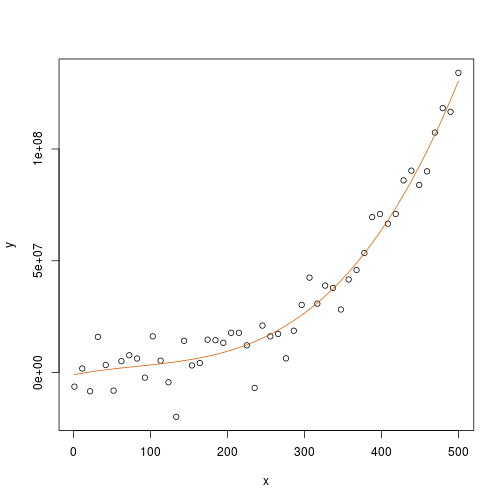

## `solve` is unstable

The QR decomposition


If you plan on calculating $\hat{\beta}=(X'X)^\top X^\top Y$ often, and especially if you plan to work with large data sets, it serves you well to learn about the QR decomposition. You can search for the details elsewhere but here is a very useful result in R


```r
n <- 50
M <- 500
x <- seq(1,M,len=n)
X <- cbind(1,x,x^2,x^3)
beta <- matrix(c(1,1,1,1),4,1)
y <- X%*%beta+rnorm(n,sd=10^7)
plot(x,y)
solve(crossprod(X))%*%crossprod(X,y)
```

```
## Error in solve.default(crossprod(X)): system is computationally singular: reciprocal condition number = 2.93617e-17
```

```r
tail(X)
```

```
##                x                   
## [45,] 1 449.0816 201674.3  90568230
## [46,] 1 459.2653 210924.6  96870361
## [47,] 1 469.4490 220382.3 103458267
## [48,] 1 479.6327 230047.5 110338284
## [49,] 1 489.8163 239920.0 117516750
## [50,] 1 500.0000 250000.0 125000000
```

```r
crossprod(X)
```

```
##                         x                          
##           50        12525 4.217364e+06 1.597455e+09
## x      12525      4217364 1.597455e+09 6.454018e+11
##      4217364   1597455115 6.454018e+11 2.716100e+14
##   1597455115 645401757068 2.716100e+14 1.175658e+17
```

```r
QR <- qr(X)
Q <- qr.Q( QR )
R <- qr.R( QR )

backsolve(R,crossprod(Q,y))
```

```
##               [,1]
## [1,] -961626.78020
## [2,]   66441.36989
## [3,]    -377.13027
## [4,]       1.53889
```

```r
plot(x,y)
fitted <- tcrossprod(Q)%*%y
lines(x,fitted,col=2)
```

 


```r
qr.X <- qr(X)
R <- qr.R(qr.X)
Q <- qr.Q(qr.X)
betahat <- backsolve(R, crossprod(Q,y) )
betahat
```

```
##               [,1]
## [1,] -961626.78020
## [2,]   66441.36989
## [3,]    -377.13027
## [4,]       1.53889
```


