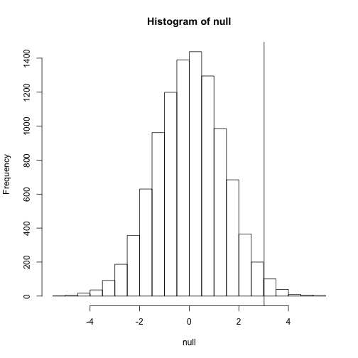

<a name="introduction"></a>

## Introduction 


This course introduces the statistical concepts necessary to understand p-value and confidence intervals. These terms are ubiquitous in the life science literature. Let's look at [this paper](http://diabetes.diabetesjournals.org/content/53/suppl_3/S215.full]) as an example. 

Note that the abstract has this statements: 

> "Body weight was higher in mice fed the high-fat diet already after the first week, due to higher dietary intake in combination with lower metabolic efficiency". 

To back this up they provide this in the results section:

> "Already during the first week after introduction of high-fat diet, body weight increased significantly more in the high-fat diet–fed mice (+1.6 ± 0.1 g) than in the normal diet–fed mice (+0.2 $\pm$ 0.1 g; P < 0.001)."

What does P < 0.001 mean? What are $\pm$ included? In this class we will learn what this mean and learn to compute these values in R. The first step is to understand what is a random variable. To understand this, we will use data from a mouse database (provided by Karen Svenson via Gary Churchill and Dan Gatti and Partially funded by P50 GM070683.) We will import the data with R and explain random variables and null distributions using R programming.

If you have the file in your working directory you can read it just one line.

```r
dat=read.csv("femaleMiceWeights.csv")
```

An alternative is to read the file from the `dagdata` package:

```r
dir <- system.file(package="dagdata")
list.files(dir)
```

```
## character(0)
```

```r
list.files(file.path(dir,"extdata"))
```

```
## character(0)
```

```r
filename <- file.path(dir,"extdata/femaleMiceWeights.csv")
dat <- read.csv(filename)
```

```
## Warning in file(file, "rt"): cannot open file
## '/extdata/femaleMiceWeights.csv': No such file or directory
```

```
## Error in file(file, "rt"): cannot open the connection
```

## Our first look at data

We are interesting determine if following a given diet makes mice heavier after several. This data was produced by ordering 24 mice from Jackson Lab, randomly assigning either chow or high fat (hf) diet. Then after several weeks we weighed each mice and obtained this data:


```r
dat
```

```
## Error in eval(expr, envir, enclos): object 'dat' not found
```

So are the hf mice heavier? Note that mouse 24 is 20.73 grams is one the lightest mice while 21 at 34.02 is one of the heaviest. Both are on the hf diet. Just from looking the data we see there is *variability*. Claims such as the one above usually refer to the averages. So let's look at the average of each group


```r
control <- dat[1:12,2]
```

```
## Error in eval(expr, envir, enclos): object 'dat' not found
```

```r
treatment <- dat[13:24,2]
```

```
## Error in eval(expr, envir, enclos): object 'dat' not found
```

```r
print(mean(treatment))
```

```
## Error in mean(treatment): object 'treatment' not found
```

```r
print(mean(control))
```

```
## Error in mean(control): object 'control' not found
```

```r
diff <- mean(treatment)-mean(control)
```

```
## Error in mean(treatment): object 'treatment' not found
```

```r
print(diff)
```

```
## function (x, ...) 
## UseMethod("diff")
## <bytecode: 0x1de2e78>
## <environment: namespace:base>
```

So the hf diet mice are about 10% heavier. Are we done? Why do we need p-values and confidence intervals? The reason is that these averages are random variables. They can take many values. 

Note that we repeat the experiment, we will obtain 24 new mice from Jackson Laboratories and when we randomly assign them to each diet we will get a different mean. Every time we repeat this experiment we get a different value. We call this type quantity a *random variable*. 

<a name="random_variable"></a>

## Random variables

Let's see this what a random variabel is. We actually have the weight of all control female mice and can load them up to R. In Statistics we refer to this as *the population*. These are all the control mice available from which we sampled 24. Note that in practice we do not have access to the population. We have a special data set that we use it here to illustrate concepts. 

Read in the data, either from your home directory or from dagdata:

```r
url <- "https://raw.githubusercontent.com/genomicsclass/dagdata/master/inst/extdata/femaleControlsPopulation.csv"
filename <- tempfile()
download.file(url,destfile=filename,method="curl")
```

```
## Warning in download.file(url, destfile = filename, method = "curl"):
## download had nonzero exit status
```

```r
population <- read.csv(filename)
```

```
## Warning in file(file, "rt"): cannot open file
## '/tmp/RtmpmKt1fI/file130518cc4f7e': No such file or directory
```

```
## Error in file(file, "rt"): cannot open the connection
```

Now let's sample 12 mice three times and see how the average changes.


```r
control <- sample(population[,1],12)
```

```
## Error in sample(population[, 1], 12): object 'population' not found
```

```r
mean(control)
```

```
## Error in mean(control): object 'control' not found
```

```r
control <- sample(population[,1],12)
```

```
## Error in sample(population[, 1], 12): object 'population' not found
```

```r
mean(control)
```

```
## Error in mean(control): object 'control' not found
```

```r
control <- sample(population[,1],12)
```

```
## Error in sample(population[, 1], 12): object 'population' not found
```

```r
mean(control)
```

```
## Error in mean(control): object 'control' not found
```

Note how the average varies. We can continue to do this over and over again and start learning something about 

<a name="null_distribution"></a>

## Null distribution

Now let's go back to our average difference of `diff`. A scientists we need to be skeptics. How do we know that this `diff` is due to the diet. What happens if we give all 24 the same diet, can we see a difference this big? Statisticians refereed to this scenario as the *null hypothesis*. The name null is used to remind us that we are acting as skeptics: there is no difference. 

Because we have access to the population, we can actually observe as many values of the difference of the averages when the diet has no effect. We can do this by sampling 24 control mice, giving them the same diet, and then recording the difference in mean between to randomly split groups. Here is the code:


```r
###12 control mice
control <- sample(population[,1],12)
```

```
## Error in sample(population[, 1], 12): object 'population' not found
```

```r
##another 12 control mice that we act as if they were not
treatment <- sample(population[,1],12)
```

```
## Error in sample(population[, 1], 12): object 'population' not found
```

```r
print(mean(treatment) - mean(control))
```

```
## Error in mean(treatment): object 'treatment' not found
```

Now let's do it 10,000 times. We will use a for-loop, an operation that let's us automatize this


```r
n <- 10000
null <- vector("numeric",n)
for(i in 1:n){
  control <- sample(population[,1],12)
  treatment <- sample(population[,1],12)
  null[i] <- mean(treatment) - mean(control)
}
```

```
## Error in sample(population[, 1], 12): object 'population' not found
```

The values in 'null' form what we call the *null distribution*. We will define this more formally below.

So what percent are bigger than `diff`?

```r
mean(null>=diff)
```

```
## Error in null >= diff: comparison (5) is possible only for atomic and list types
```

Only 1.5%. So what do we conclude as skeptics. When there is no diet effect, we see value as big as `diff` only 1.5% of the time. Note that this is what is known as a p-value which we will also define more formally later

##Illustration of the null distribution
Let's repeat the loop above but this time let's add a point to the figure every time we re-run the experiment


```r
n <- 100
plot(0,0,xlim=c(-5,5),ylim=c(1,30),type="n")
```

 

```r
totals <- vector("numeric",11)
for(i in 1:n){
  control <- sample(population[,1],12)
  treatment <- sample(population[,1],12)
  nulldiff <- mean(treatment) - mean(control)
  j <- pmax(pmin(round(nulldiff)+6,11),1)
  totals[j]<-totals[j]+1
  text(j-6,totals[j],pch=15,round(nulldiff,1))
  ##if(i < 15) scan() ##You can add this line to interactively see values appear
  }
```

```
## Error in sample(population[, 1], 12): object 'population' not found
```

<a name="distributions"></a>

## Distributions

We have explained what we mean by *null* in the context of null hypothesis but what exactly is a distribution?
The simplest way to think of a *distribution* is as a compact description of many numbers. For example, in the previous section we defined an object 'null' with 10,000 average differences created under the null. To define a distribution we compute, for all possible values of $a$ the proportion of numbers in our list that are below $a$. We use the following notation

$$ F(a) \equiv \mbox{Pr}(x \leq a) $$

This is called the empirical commutative distribution function. We can plot $F(a)$ versus $a$ like this


```r
values <- seq(min(null),max(null),len=300)
myecdf <- ecdf(null)
plot(values,myecdf(values),type="l")
```

 

The `ecdf` function is not typical and we won't discuss it here. Furthermore, these ecdfs are actually not as popular as histograms which give us the same information but show us the proportion of values in intervals

$$\mbox{Pr}(a \leq x \leq b) = F(b)-F(a)$$.

This is a more useful plot because we are usually more interested in intervals. It is also easier to distinguish different types (families) of distributions by looking at histograms. 

Note that from the histogram we can see that values as large as `diff` are relatively rare

```r
hist(null)
```

 

```r
abline(v=diff)
```

```
## Error in int_abline(a = a, b = b, h = h, v = v, untf = untf, ...): cannot coerce type 'closure' to vector of type 'double'
```

We will provide more details on histograms in later chapters. 

An important point to keep in mind here is that while we defined $Pr(a)$ by counting cases, we will learn how, in some circumstances, mathematics gives us formulas for $Pr(a)$ that save us the trouble of computing them as we did here.

<a name="normal_distribution"></a>

## Normal distribution
If instead of the total numbers we report the proportions, then the histogram is a probability distribution. The probability distribution we see above approximates one that is very common in a nature: the bell curve or normal distribution or Gaussian distribution. When the histogram of a list of numbers approximates the normal distribution we can use a convenient mathematical formula to approximate the proportion of individuals in any given interval

$$
\mbox{Pr}(a < x < b) = \int_a^b \frac{1}{\sqrt{2\pi\sigma^2}} \exp{\left( \frac{-(x-\mu)^2}{2 \sigma^2} \right)} \, dx
$$

Here $\mu$ and $\sigma$ are refereed to as the mean and standard deviation. If this approximation holds for our list then the population mean and variance of our list can be used in the formula above. To see this with an example remember that above we noted that only 1.5% of values on the null distribution were above `diff`. We can compute the proportion of values below a value `x` with `pnorm(x,mu,sigma)` without knowing all the values. The normal approximation works very well here:


```r
1-pnorm(diff,mean(null),sd(null)) 
```

```
## Error in pnorm(diff, mean(null), sd(null)): Non-numeric argument to mathematical function
```

Later we will learn there is a mathematical explanation for this. A very useful characteristic of this approximation is that one only needs to know $\mu$ and $\sigma$ to describe the entire distribution. From this we can compute the proportion of values in any interval. 

##Summary
So this was pretty easy no? But why are we not done? Note that to make this calculation we did the equivalent of buying all the mice available from Jackson laboratories and performed our experiment over and over again to define the null distribution. This is not something we can do in practice. Statistical Inference is the mathematical theory that permits you to approximate this with only the data from your sample, i.e. the original 24 mice. This is what we will learn in the following sections. 


