## Wilcoxon signed-rank test

The normal apporximatiion is often useful when analyzing 
high throughput data. However, due to the complexity of the measurement devices it is also common to mistakenly  observe data points generated by an undesired process. For example, a defect on a scanner can produce a hanful of very high intensities. Thus we may have situationst that are approximated by a, for example, 99 data points from a standard normal distribution and one very large number.


```r
set.seed(1)
N = 25
B = 10000
X <- matrix(rnorm(N * B, 0, 1), B, N)
Y <- matrix(rnorm(N * B, 0, 1), B, N)
Y[, 1] <- 5
Y[, 2] <- 7  ##two outliers
ps = sapply(1:B, function(i) {
    return(c(t.test(X[i, ], Y[i, ])$p.value, wilcox.test(X[i, ], Y[i, ])$p.value))
})
mypar(1, 2)
```

```
## Error: could not find function "mypar"
```

```r
hist(ps[1, ], nc = 20, xlab = "p-values", ylim = c(0, 1100), main = "t-stat")
```

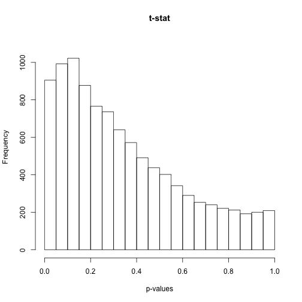 

```r
hist(ps[2, ], nc = 20, xlab = "p-values", ylim = c(0, 1100), main = "Wilcoxon")
```

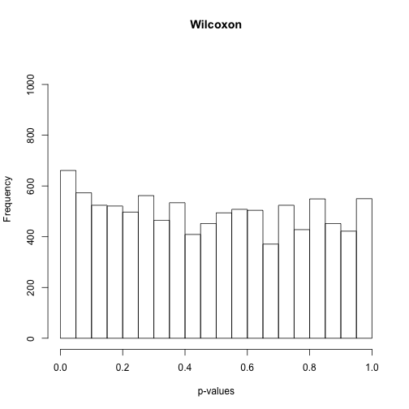 


```r
i <- which.max((ps[2, ] - ps[1, ]) * (ps[1, ] < 0.05))
x = X[i, ]
y = Y[i, ]
stripchart(list(x, y), vertical = TRUE, ylim = c(-7, 7), ylab = "Observations", 
    pch = 21, bg = 1, cex = 1.25)
abline(h = 0)
```

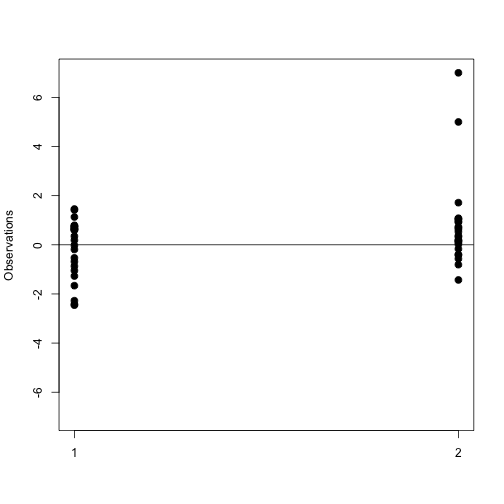 

```r
xrank <- rank(c(x, y))[seq(along = x)]
yrank <- rank(c(x, y))[-seq(along = y)]
stripchart(list(xrank, yrank), vertical = TRUE, ylab = "Ranks", pch = 21, bg = 1, 
    cex = 1.25)
ws <- sapply(x, function(z) rank(c(z, y))[1] - 1)
text(rep(1.05, length(ws)), xrank, ws)
```

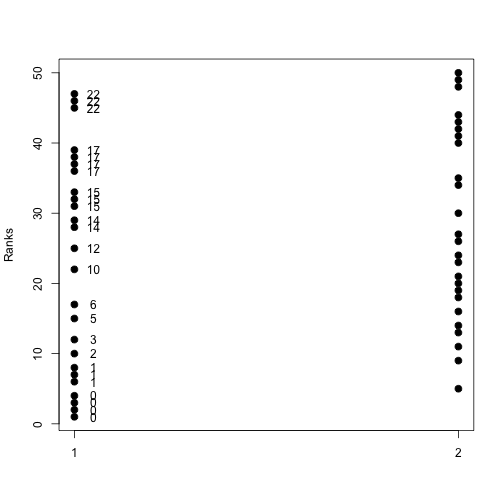 

```r
W <- sum(ws)
n1 <- length(x)
n2 <- length(y)
Z <- (mean(ws) - n2/2)/sqrt(n2 * (n1 + n2 + 1)/12/n1)
```


```r
stripchart(y - x, vertical = TRUE, ylim = c(-8, 8))
abline(h = 0)
```

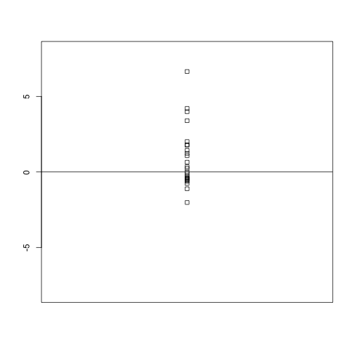 

```r
stripchart(rank(abs(y - x)) * sign(y - x), vertical = TRUE, ylim = c(-25, 25))
abline(h = 0)
```

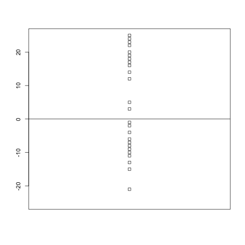 

```r
W = sum(abs(rank(abs(y - x)) * sign(y - x)))
```


```r
tab = cbind(sign(y - x), abs(y - x), rank(abs(y - x)))
tab = tab[order(tab[, 2]), ]
```


In statistics we refer these types of points as _outliers_. A small number of outliers can throw of an entire analysis. For example notice how this one point results in the sample mean and sample variace being very far from the 0 and 1 respectively.

```r
mean(x)
```

```
## [1] -0.1082
```

```r
sd(x)
```

```
## [1] 1.184
```

The median, defined as the point having half the data larger and half the data smaller, is summary statistic that is _robust_ to outliers. Note how much close the median is to 0, the center of out actual distribution. 

```r
median(x)
```

```
## [1] 0.3499
```


The median absolute deviace (MAD) is a robust summary for the standard deviation. It is defined by computing the differences between each point and the median and taking the median of their absolute values:
$$
 1.4826 \mbox{median}\{| X_i - \mbox{median}(X_i)|\}
$$
The number $1.4826$ is a scale factor that guarantees an unbiased 
estimate of the actual center. Notice how much closer we are to one with the mad:

```r
mad(x)
```

```
## [1] 0.8003
```


## Spearman correlation
The correlation is also sensitive to outliers. Here we construct a independent list of numbers but for which a simialr mistake was made for the same entry:


```r
set.seed(1)
x = c(rnorm(100, 0, 1))  ##real distribution
x[23] <- 100  ##mistake made in 23th measurement
y = c(rnorm(100, 0, 1))  ##real distribution
y[23] <- 84  ##similar mistake made in 23th measurement
library(rafalib)
```

```
## Loading required package: RColorBrewer
```

```r
mypar(1, 1)
plot(x, y, main = paste0("correlation=", round(cor(x, y), 3)), pch = 21, bg = 1, 
    xlim = c(-3, 100), ylim = c(-3, 100))
abline(0, 1)
```

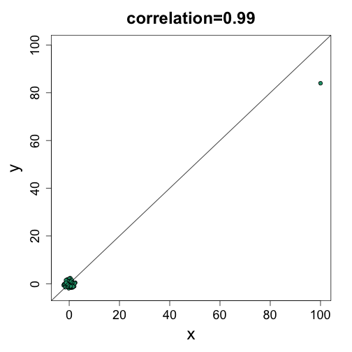 


## Rank tests

We use the same data as in previous module. We have data for two strains of mice which we will refer to as strain 0 and 1. We want to know which genes are differentially expressed.  We extracted RNA from 12 randomly selected mice from each strain [(Kendziorski 2005)](#foot). In one experiment we pooled the RNA from all individuals from each strain and then created 4 replicate samples from this pool. 


```r
library(Biobase, quietly = TRUE, verbose = FALSE)
```

```
## Loading required package: methods
## Loading required package: parallel
## 
## Attaching package: 'BiocGenerics'
## 
## The following objects are masked from 'package:parallel':
## 
##     clusterApply, clusterApplyLB, clusterCall, clusterEvalQ,
##     clusterExport, clusterMap, parApply, parCapply, parLapply,
##     parLapplyLB, parRapply, parSapply, parSapplyLB
## 
## The following object is masked from 'package:stats':
## 
##     xtabs
## 
## The following objects are masked from 'package:base':
## 
##     anyDuplicated, append, as.data.frame, as.vector, cbind,
##     colnames, do.call, duplicated, eval, evalq, Filter, Find, get,
##     intersect, is.unsorted, lapply, Map, mapply, match, mget,
##     order, paste, pmax, pmax.int, pmin, pmin.int, Position, rank,
##     rbind, Reduce, rep.int, rownames, sapply, setdiff, sort,
##     table, tapply, union, unique, unlist
## 
## Welcome to Bioconductor
## 
##     Vignettes contain introductory material; view with
##     'browseVignettes()'. To cite Bioconductor, see
##     'citation("Biobase")', and for packages 'citation("pkgname")'.
```

```r
library(genefilter)
```

```
## 
## Attaching package: 'genefilter'
## 
## The following object is masked from 'package:base':
## 
##     anyNA
```

```r
library(dagdata)
data(maPooling)
pd = pData(maPooling)
individuals = which(rowSums(pd) == 1)
## remove replicates
individuals = individuals[-grep("tr", names(individuals))]
y = exprs(maPooling)[, individuals]
group = factor(as.numeric(grepl("b", names(individuals))))
```


We can compute the sample variance for each gene and compare to the standard deviation obtained with the technical replicates.

```r
ind1 <- which(group == 1)
ind0 <- which(group == 0)
wilcox <- apply(y, 1, function(x) {
    tmp <- wilcox.test(x[ind1], x[ind0], exact = FALSE)
    c(tmp$statistic, tmp$p.value)
})
ttest <- genefilter::rowttests(y, group)
ind <- which(ttest$p.val < 0.05 & wilcox[2, ] > 0.05)
```

```
## Warning: Name partially matched in data frame
```

```r
mypar(3, 3)
for (i in ind) stripchart(split(y[i, ], group), vertical = TRUE, jitter = 0.2)
```

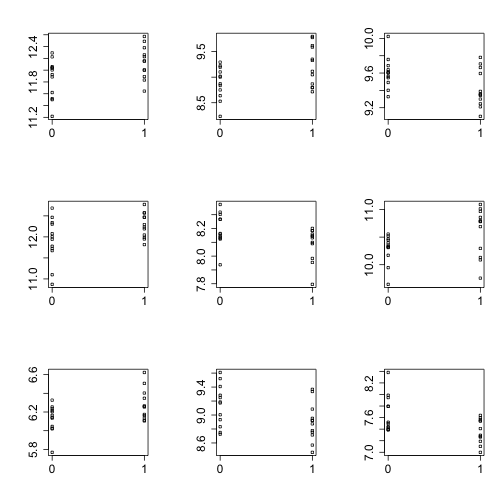 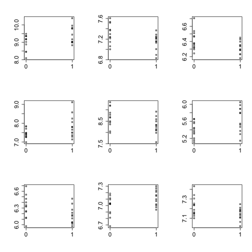 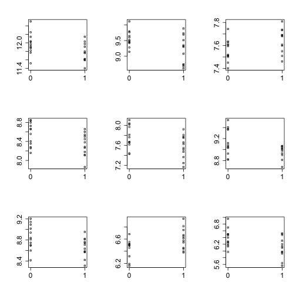 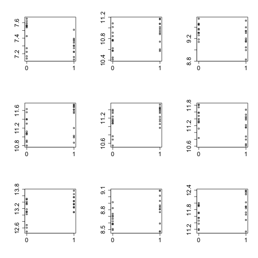 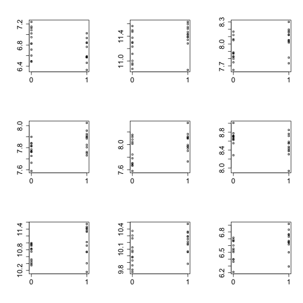 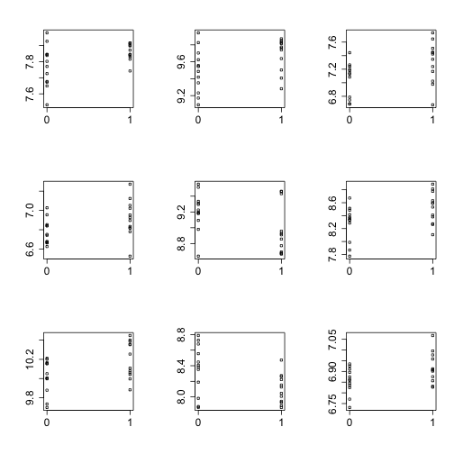 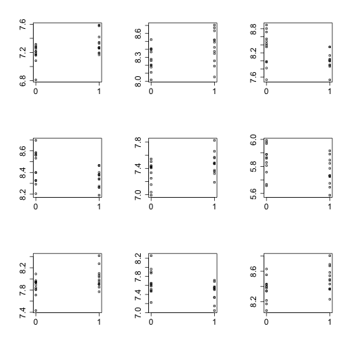 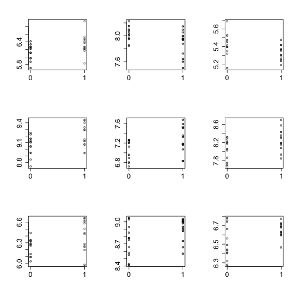 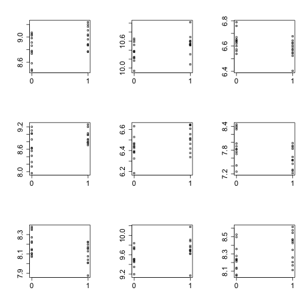 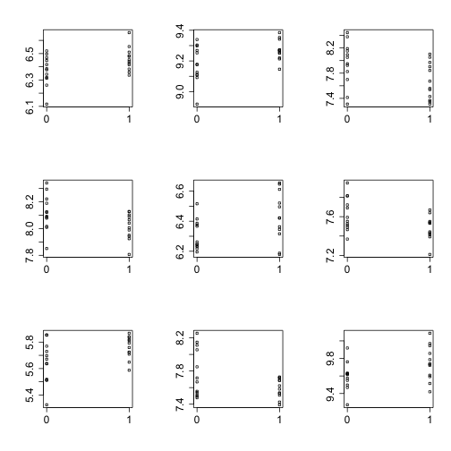 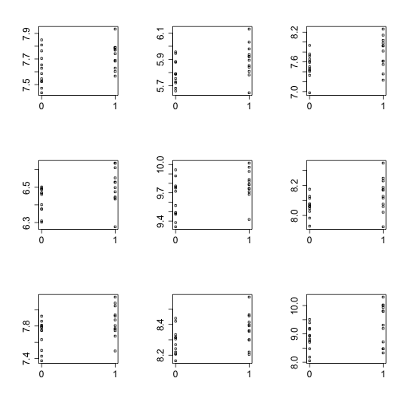 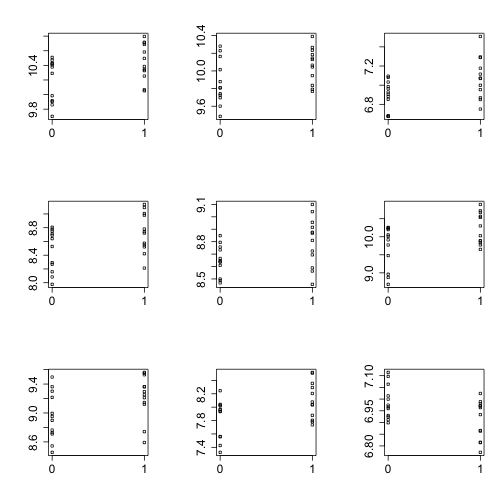 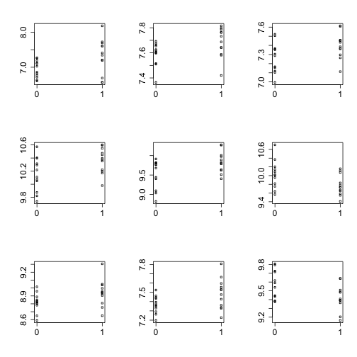 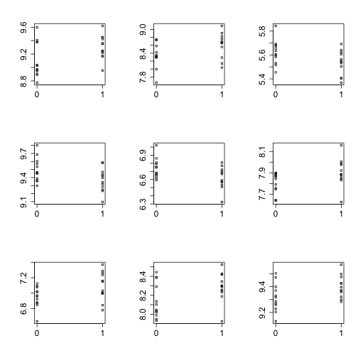 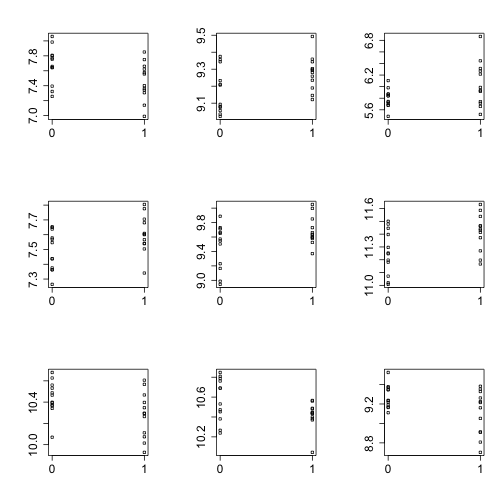 

```r
ind
```

```
##   1367661_at   1367785_at   1367833_at   1368037_at   1368159_at 
##          210          334          382          586          708 
## 1368202_a_at   1368283_at   1368505_at   1368530_at   1368813_at 
##          751          832         1054         1079         1362 
##   1369061_at   1369136_at   1369150_at   1369157_at   1369203_at 
##         1610         1685         1699         1706         1752 
##   1369499_at   1369843_at   1370102_at   1370161_at   1370295_at 
##         2048         2392         2651         2710         2844 
##   1370423_at   1370445_at   1370869_at   1370882_at   1370904_at 
##         2972         2994         3418         3431         3453 
##   1370913_at   1371194_at   1371262_at   1371341_at   1371345_at 
##         3462         3743         3811         3890         3894 
##   1371352_at   1371382_at   1371390_at   1371414_at   1371752_at 
##         3901         3931         3939         3963         4301 
##   1371776_at   1371785_at   1371838_at   1371879_at   1372040_at 
##         4325         4334         4387         4428         4589 
##   1372191_at   1372209_at   1372219_at   1372330_at   1372449_at 
##         4740         4758         4768         4879         4998 
##   1372493_at   1372529_at   1372646_at   1372751_at   1372752_at 
##         5042         5078         5195         5300         5301 
##   1372770_at   1372772_at   1373219_at   1373251_at   1373287_at 
##         5319         5321         5768         5800         5836 
##   1373419_at   1373519_at   1373645_at   1373666_at   1373801_at 
##         5968         6068         6194         6215         6350 
##   1373808_at   1373914_at   1373941_at   1373992_at   1374177_at 
##         6357         6463         6490         6541         6726 
##   1374238_at   1374414_at   1374434_at   1374723_at 1374879_x_at 
##         6787         6963         6983         7272         7428 
##   1374905_at   1375056_at   1375213_at   1375640_at   1375818_at 
##         7454         7605         7762         8189         8367 
##   1375867_at   1376183_at   1376200_at   1376331_at   1376337_at 
##         8416         8732         8749         8880         8886 
##   1376347_at   1376385_at   1376553_at   1376619_at   1376696_at 
##         8896         8934         9102         9168         9245 
##   1376860_at   1376879_at   1376920_at   1376962_at   1377103_at 
##         9409         9428         9469         9511         9652 
##   1377125_at   1377180_at   1377208_at   1377218_at   1377239_at 
##         9674         9729         9757         9767         9788 
##   1378535_at   1379302_at   1386854_at   1386869_at   1386880_at 
##        10169        10208        10974        10988        10999 
##   1386915_at   1387015_at   1387018_at   1387081_at   1387343_at 
##        11034        11134        11137        11200        11462 
##   1387521_at   1387548_at   1387726_at 1387767_a_at   1387849_at 
##        11640        11667        11845        11886        11968 
## 1387952_a_at   1388129_at   1388164_at   1388427_at   1388999_at 
##        12071        12248        12283        12546        13118 
##   1389215_at   1389323_at   1389355_at   1389439_at   1389462_at 
##        13334        13442        13474        13558        13581 
##   1389587_at   1389737_at   1390110_at   1390136_at   1390185_at 
##        13706        13856        14229        14255        14304 
##   1390244_at   1390412_at   1390490_at   1391125_at   1392958_at 
##        14363        14531        14609        14901        15029 
##   1398296_at   1398873_at   1398894_at   1398923_at   1398943_at 
##        15256        15572        15593        15622        15642 
##   1399115_at   1399133_at 
##        15814        15832
```

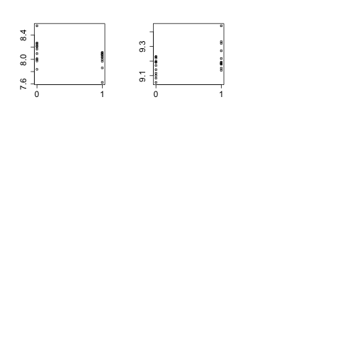 


## Footnotes
<a name="foot"></a>

C. Kendziorski, R. A. Irizarry, K.-S. Chen, J. D. Haag, and M. N. Gould, "On the utility of pooling biological samples in microarray experiments", PNAS, 2005. <http://www.pnas.org/content/102/12/4252.long>

