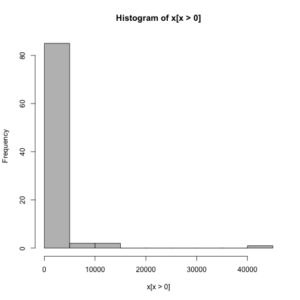
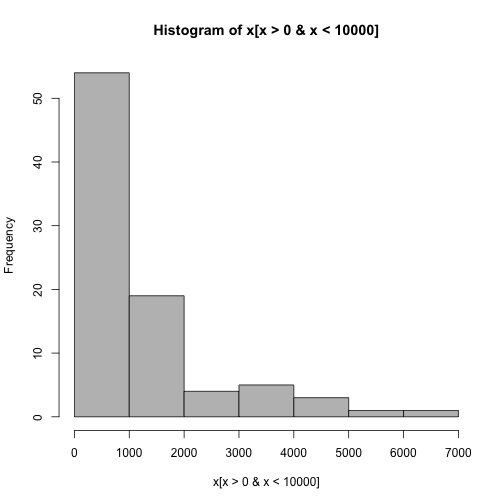
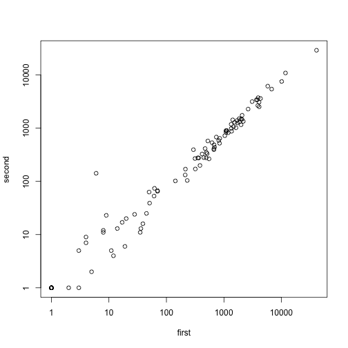
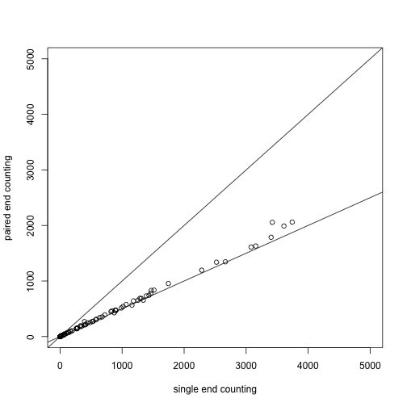

The following lab will describe how to count NGS reads which fall into genomic features. We want to end up with a count matrix which has rows corresponding to genomic ranges and columns which correspond to different experiments or samples. As an example, we will use an RNA-Seq experiment, with files in the `pasillaBamSubset` Bioconductor data package. However, the same functions can be used for DNA-Seq, ChIP-Seq, etc.


```r
# biocLite('pasillaBamSubset')
# biocLite('TxDb.Dmelanogaster.UCSC.dm3.ensGene')
library(pasillaBamSubset)
library(TxDb.Dmelanogaster.UCSC.dm3.ensGene)
```

```
## Loading required package: GenomicFeatures
## Loading required package: BiocGenerics
## Loading required package: methods
## Loading required package: parallel
## 
## Attaching package: 'BiocGenerics'
## 
## The following objects are masked from 'package:parallel':
## 
##     clusterApply, clusterApplyLB, clusterCall, clusterEvalQ,
##     clusterExport, clusterMap, parApply, parCapply, parLapply,
##     parLapplyLB, parRapply, parSapply, parSapplyLB
## 
## The following object is masked from 'package:stats':
## 
##     xtabs
## 
## The following objects are masked from 'package:base':
## 
##     anyDuplicated, append, as.data.frame, as.vector, cbind,
##     colnames, do.call, duplicated, eval, evalq, Filter, Find, get,
##     intersect, is.unsorted, lapply, Map, mapply, match, mget,
##     order, paste, pmax, pmax.int, pmin, pmin.int, Position, rank,
##     rbind, Reduce, rep.int, rownames, sapply, setdiff, sort,
##     table, tapply, union, unique, unlist
## 
## Loading required package: IRanges
## Loading required package: GenomicRanges
## Loading required package: GenomeInfoDb
## Loading required package: AnnotationDbi
## Loading required package: Biobase
## Welcome to Bioconductor
## 
##     Vignettes contain introductory material; view with
##     'browseVignettes()'. To cite Bioconductor, see
##     'citation("Biobase")', and for packages 'citation("pkgname")'.
```


We load a transcript database object. These are prebuilt in R for various well studied organisms, for example `TxDb.Hsapiens.UCSC.hg19.knownGene`. In addition the `makeTranscriptDbFromGFF` file can be used to import GFF or GTF gene models. We use the `exonsBy` function to get a `GRangesList` object of the exons for each gene.


```r
txdb <- TxDb.Dmelanogaster.UCSC.dm3.ensGene
grl <- exonsBy(txdb, by = "gene")
grl[100]
```

```
## GRangesList of length 1:
## $FBgn0000286 
## GRanges with 8 ranges and 2 metadata columns:
##       seqnames             ranges strand |   exon_id   exon_name
##          <Rle>          <IRanges>  <Rle> | <integer> <character>
##   [1]    chr2L [4876890, 4879196]      - |      8515        <NA>
##   [2]    chr2L [4877289, 4879196]      - |      8516        <NA>
##   [3]    chr2L [4880294, 4880472]      - |      8517        <NA>
##   [4]    chr2L [4880378, 4880472]      - |      8518        <NA>
##   [5]    chr2L [4881215, 4882492]      - |      8519        <NA>
##   [6]    chr2L [4882865, 4883113]      - |      8520        <NA>
##   [7]    chr2L [4882889, 4883113]      - |      8521        <NA>
##   [8]    chr2L [4882889, 4883341]      - |      8522        <NA>
## 
## ---
## seqlengths:
##      chr2L     chr2R     chr3L     chr3R ...   chrXHet   chrYHet chrUextra
##   23011544  21146708  24543557  27905053 ...    204112    347038  29004656
```

```r
grl[[100]]
```

```
## GRanges with 8 ranges and 2 metadata columns:
##       seqnames             ranges strand |   exon_id   exon_name
##          <Rle>          <IRanges>  <Rle> | <integer> <character>
##   [1]    chr2L [4876890, 4879196]      - |      8515        <NA>
##   [2]    chr2L [4877289, 4879196]      - |      8516        <NA>
##   [3]    chr2L [4880294, 4880472]      - |      8517        <NA>
##   [4]    chr2L [4880378, 4880472]      - |      8518        <NA>
##   [5]    chr2L [4881215, 4882492]      - |      8519        <NA>
##   [6]    chr2L [4882865, 4883113]      - |      8520        <NA>
##   [7]    chr2L [4882889, 4883113]      - |      8521        <NA>
##   [8]    chr2L [4882889, 4883341]      - |      8522        <NA>
##   ---
##   seqlengths:
##        chr2L     chr2R     chr3L ...   chrXHet   chrYHet chrUextra
##     23011544  21146708  24543557 ...    204112    347038  29004656
```

```r
grl[[100]][1]
```

```
## GRanges with 1 range and 2 metadata columns:
##       seqnames             ranges strand |   exon_id   exon_name
##          <Rle>          <IRanges>  <Rle> | <integer> <character>
##   [1]    chr2L [4876890, 4879196]      - |      8515        <NA>
##   ---
##   seqlengths:
##        chr2L     chr2R     chr3L ...   chrXHet   chrYHet chrUextra
##     23011544  21146708  24543557 ...    204112    347038  29004656
```


These functions in the `pasillaBamSubset` package just point us to the BAM files.


```r
fl1 <- untreated1_chr4()
fl2 <- untreated3_chr4()
fl1
```

```
## [1] "/usr/local/Cellar/r/3.1.0/R.framework/Versions/3.1/Resources/library/pasillaBamSubset/extdata/untreated1_chr4.bam"
```


We need the following libraries for counting BAM files.


```r
library(Rsamtools)
```

```
## Loading required package: XVector
## Loading required package: Biostrings
```

```r
library(GenomicRanges)
```


Note: if you are using Bioconductor version 14, paired with R 3.1, you should also load this library. You do not need to load this library, and it will not be available to you, if you are using Bioconductor version 13, paired with R 3.0.x.


```r
library(GenomicAlignments)
```

```
## Loading required package: BSgenome
## 
## Attaching package: 'BSgenome'
## 
## The following object is masked from 'package:AnnotationDbi':
## 
##     species
```


We specify the files using the `BamFileList` function. This allows us to tell the read counting functions how many reads to load at once. For larger files, yield size of 1 million reads might make sense.


```r
fls <- BamFileList(c(fl1, fl2), yieldSize = 50000)
names(fls) <- c("first", "second")
```


The following function counts the overlaps of the reads in the BAM files in the features, which are the genes of Drosophila. We tell the counting function to ignore the strand, i.e., to allow minus strand reads to count in plus strand genes, and vice versa.


```r
so1 <- summarizeOverlaps(features = grl, reads = fls, ignore.strand = TRUE)
so1
```

```
## class: SummarizedExperiment 
## dim: 15682 2 
## exptData(0):
## assays(1): counts
## rownames(15682): FBgn0000003 FBgn0000008 ... FBgn0264726
##   FBgn0264727
## rowData metadata column names(0):
## colnames(2): first second
## colData names(0):
```


We can examine the count matrix, which is stored in the `assay` slot:


```r
head(assay(so1))
```

```
##             first second
## FBgn0000003     0      0
## FBgn0000008     0      0
## FBgn0000014     0      0
## FBgn0000015     0      0
## FBgn0000017     0      0
## FBgn0000018     0      0
```

```r
colSums(assay(so1))
```

```
##  first second 
## 156469 122872
```


The other parts of a `SummarizedExperiment`, as described in the lab in Week 2: Basic Bioconductor Infrastructure.


```r
rowData(so1)
```

```
## GRangesList of length 15682:
## $FBgn0000003 
## GRanges with 1 range and 2 metadata columns:
##       seqnames             ranges strand |   exon_id   exon_name
##          <Rle>          <IRanges>  <Rle> | <integer> <character>
##   [1]    chr3R [2648220, 2648518]      + |     45123        <NA>
## 
## $FBgn0000008 
## GRanges with 13 ranges and 2 metadata columns:
##        seqnames               ranges strand   | exon_id exon_name
##    [1]    chr2R [18024494, 18024531]      +   |   20314      <NA>
##    [2]    chr2R [18024496, 18024713]      +   |   20315      <NA>
##    [3]    chr2R [18024938, 18025756]      +   |   20316      <NA>
##    [4]    chr2R [18025505, 18025756]      +   |   20317      <NA>
##    [5]    chr2R [18039159, 18039200]      +   |   20322      <NA>
##    ...      ...                  ...    ... ...     ...       ...
##    [9]    chr2R [18058283, 18059490]      +   |   20326      <NA>
##   [10]    chr2R [18059587, 18059757]      +   |   20327      <NA>
##   [11]    chr2R [18059821, 18059938]      +   |   20328      <NA>
##   [12]    chr2R [18060002, 18060339]      +   |   20329      <NA>
##   [13]    chr2R [18060002, 18060346]      +   |   20330      <NA>
## 
## ...
## <15680 more elements>
## ---
## seqlengths:
##      chr2L     chr2R     chr3L     chr3R ...   chrXHet   chrYHet chrUextra
##   23011544  21146708  24543557  27905053 ...    204112    347038  29004656
```

```r
colData(so1)
```

```
## DataFrame with 2 rows and 0 columns
```

```r
colData(so1)$sample <- c("one", "two")
colData(so1)
```

```
## DataFrame with 2 rows and 1 column
##             sample
##        <character>
## first          one
## second         two
```

```r
metadata(rowData(so1))
```

```
## $genomeInfo
## $genomeInfo$`Db type`
## [1] "TranscriptDb"
## 
## $genomeInfo$`Supporting package`
## [1] "GenomicFeatures"
## 
## $genomeInfo$`Data source`
## [1] "UCSC"
## 
## $genomeInfo$Genome
## [1] "dm3"
## 
## $genomeInfo$Organism
## [1] "Drosophila melanogaster"
## 
## $genomeInfo$`UCSC Table`
## [1] "ensGene"
## 
## $genomeInfo$`Resource URL`
## [1] "http://genome.ucsc.edu/"
## 
## $genomeInfo$`Type of Gene ID`
## [1] "Ensembl gene ID"
## 
## $genomeInfo$`Full dataset`
## [1] "yes"
## 
## $genomeInfo$`miRBase build ID`
## [1] NA
## 
## $genomeInfo$transcript_nrow
## [1] "29173"
## 
## $genomeInfo$exon_nrow
## [1] "76920"
## 
## $genomeInfo$cds_nrow
## [1] "62135"
## 
## $genomeInfo$`Db created by`
## [1] "GenomicFeatures package from Bioconductor"
## 
## $genomeInfo$`Creation time`
## [1] "2014-03-17 16:24:54 -0700 (Mon, 17 Mar 2014)"
## 
## $genomeInfo$`GenomicFeatures version at creation time`
## [1] "1.15.11"
## 
## $genomeInfo$`RSQLite version at creation time`
## [1] "0.11.4"
## 
## $genomeInfo$DBSCHEMAVERSION
## [1] "1.0"
```


We can do some basic exploratory data analysis of the counts:


```r
x <- assay(so1)[, 1]
hist(x[x > 0], col = "grey")
```

 

```r
hist(x[x > 0 & x < 10000], col = "grey")
```

 

```r
plot(assay(so1) + 1, log = "xy")
```

 


The second file should actually be counted in a special manner, as it contains pairs of reads which come from a single fragment. We do not want to count these twice, so we set `singleEnd = FALSE`. Additionally, we specify `fragments = TRUE` which counts reads if only one of the pair aligns to the features, and the other pair aligns to no feature.


```r
# ?untreated3_chr4 ?summarizeOverlaps
fls <- BamFileList(fl2, yieldSize = 50000)
so2 <- summarizeOverlaps(features = grl, reads = fls, ignore.strand = TRUE, 
    singleEnd = FALSE, fragments = TRUE)
colSums(assay(so2))
```

```
## untreated3_chr4.bam 
##               65591
```

```r
colSums(assay(so1))
```

```
##  first second 
## 156469 122872
```

```r
plot(assay(so1)[, 2], assay(so2)[, 1], xlim = c(0, 5000), ylim = c(0, 5000), 
    xlab = "single end counting", ylab = "paired end counting")
abline(0, 1)
abline(0, 0.5)
```

 


## Footnotes

### Methods for counting reads which overlap features

Bioconductor packages:

- `summarizeOverlaps` in the `GenomicAlignments` package

<http://www.bioconductor.org/packages/devel/bioc/html/GenomicAlignments.html>

- `featureCounts` in the `Rsubread` package

Liao Y, Smyth GK, Shi W., "featureCounts: an efficient general purpose program for assigning sequence reads to genomic features." Bioinformatics. 2014
<http://www.ncbi.nlm.nih.gov/pubmed/24227677>
<http://bioinf.wehi.edu.au/featureCounts/>

- `easyRNAseq` package

Delhomme N1, Padioleau I, Furlong EE, Steinmetz LM. "easyRNASeq: a bioconductor package for processing RNA-Seq data." Bioinformatics. 2012.
<http://www.ncbi.nlm.nih.gov/pubmed/22847932>
<http://www.bioconductor.org/packages/release/bioc/html/easyRNASeq.html>

Command line tools: 

- `htseq-count`, a program in the `htseq` Python package

Simon Anders, Paul Theodor Pyl, Wolfgang Huber.
HTSeq — A Python framework to work with high-throughput sequencing data
bioRxiv preprint (2014), doi: [10.1101/002824](http://dx.doi.org/10.1101/002824)

<http://www-huber.embl.de/users/anders/HTSeq/doc/count.html>

- `bedtools` <https://code.google.com/p/bedtools/>

- `bedops` <https://code.google.com/p/bedops/>


