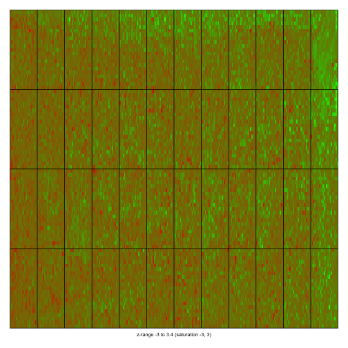

## Affymterix CEL files

First we save the initial working directory, so we can return to it.


```r
wd <- getwd()
```


We start by reading in the sample information table. This is usually created by the person who performed the experiment. 


```r
library(affy)
```

```
## Loading required package: BiocGenerics
## Loading required package: methods
## Loading required package: parallel
## 
## Attaching package: 'BiocGenerics'
## 
## The following objects are masked from 'package:parallel':
## 
##     clusterApply, clusterApplyLB, clusterCall, clusterEvalQ,
##     clusterExport, clusterMap, parApply, parCapply, parLapply,
##     parLapplyLB, parRapply, parSapply, parSapplyLB
## 
## The following object is masked from 'package:stats':
## 
##     xtabs
## 
## The following objects are masked from 'package:base':
## 
##     anyDuplicated, append, as.data.frame, as.vector, cbind,
##     colnames, do.call, duplicated, eval, evalq, Filter, Find, get,
##     intersect, is.unsorted, lapply, Map, mapply, match, mget,
##     order, paste, pmax, pmax.int, pmin, pmin.int, Position, rank,
##     rbind, Reduce, rep.int, rownames, sapply, setdiff, sort,
##     table, tapply, union, unique, unlist
## 
## Loading required package: Biobase
## Welcome to Bioconductor
## 
##     Vignettes contain introductory material; view with
##     'browseVignettes()'. To cite Bioconductor, see
##     'citation("Biobase")', and for packages 'citation("pkgname")'.
```

```r
basedir <- "celfiles"
setwd(basedir)
tab <- read.delim("sampleinfo.txt", check.names = FALSE, as.is = TRUE)
rownames(tab) <- tab$filenames
tab
```

```
##                                       filenames 37777_at 684_at 1597_at
## 1521a99hpp_av06.CEL.gz   1521a99hpp_av06.CEL.gz     0.00   0.25     0.5
## 1532a99hpp_av04.CEL.gz   1532a99hpp_av04.CEL.gz     0.00   0.25     0.5
## 2353a99hpp_av08.CEL.gz   2353a99hpp_av08.CEL.gz     0.00   0.25     0.5
## 1521b99hpp_av06.CEL.gz   1521b99hpp_av06.CEL.gz     0.25   0.50     1.0
## 1532b99hpp_av04.CEL.gz   1532b99hpp_av04.CEL.gz     0.25   0.50     1.0
## 2353b99hpp_av08r.CEL.gz 2353b99hpp_av08r.CEL.gz     0.25   0.50     1.0
##                         38734_at 39058_at 36311_at 36889_at 1024_at
## 1521a99hpp_av06.CEL.gz         1        2        4        8      16
## 1532a99hpp_av04.CEL.gz         1        2        4        8      16
## 2353a99hpp_av08.CEL.gz         1        2        4        8      16
## 1521b99hpp_av06.CEL.gz         2        4        8       16      32
## 1532b99hpp_av04.CEL.gz         2        4        8       16      32
## 2353b99hpp_av08r.CEL.gz        2        4        8       16      32
##                         36202_at 36085_at 40322_at 407_at 1091_at 1708_at
## 1521a99hpp_av06.CEL.gz        32       64      128   0.00     512    1024
## 1532a99hpp_av04.CEL.gz        32       64      128   0.00     512    1024
## 2353a99hpp_av08.CEL.gz        32       64      128   0.00     512    1024
## 1521b99hpp_av06.CEL.gz        64      128      256   0.25    1024       0
## 1532b99hpp_av04.CEL.gz        64      128      256   0.25    1024       0
## 2353b99hpp_av08r.CEL.gz       64      128      256   0.25    1024       0
##                         33818_at 546_at
## 1521a99hpp_av06.CEL.gz       256     32
## 1532a99hpp_av04.CEL.gz       256     32
## 2353a99hpp_av08.CEL.gz       256     32
## 1521b99hpp_av06.CEL.gz       512     64
## 1532b99hpp_av04.CEL.gz       512     64
## 2353b99hpp_av08r.CEL.gz      512     64
```

```r
fns <- list.celfiles()
fns
```

```
## [1] "1521a99hpp_av06.CEL.gz"  "1521b99hpp_av06.CEL.gz" 
## [3] "1532a99hpp_av04.CEL.gz"  "1532b99hpp_av04.CEL.gz" 
## [5] "2353a99hpp_av08.CEL.gz"  "2353b99hpp_av08r.CEL.gz"
```

```r
fns %in% tab[, 1]  ##check
```

```
## [1] TRUE TRUE TRUE TRUE TRUE TRUE
```

```r
ab <- ReadAffy(phenoData = tab)
```


This creates an AffyBatch object which object contains the information you need.


```r
dim(pm(ab))
```

```
## Warning: replacing previous import by 'utils::head' when loading 'hgu95acdf'
## Warning: replacing previous import by 'utils::tail' when loading 'hgu95acdf'
```

```
## 
```

```
## [1] 201807      6
```

```r
dim(pData(ab))
```

```
## [1]  6 17
```

```r
annotation(ab)
```

```
## [1] "hgu95a"
```


Note, this object You can then preprocess RMA

```r
e <- rma(ab)
```

```
## Background correcting
## Normalizing
## Calculating Expression
```


Now we go back to the previous working directory.


```r
setwd(wd)
```


If you are not interested in probe level data you could can use this function


```r
setwd(basedir)
ejust <- justRMA(filenames = tab[, 1], phenoData = tab)
dim(ejust)
```

```
## Features  Samples 
##    12626        6
```


##Agilent data


```r
library(limma)
```

```
## 
## Attaching package: 'limma'
## 
## The following object is masked from 'package:BiocGenerics':
## 
##     plotMA
```

```r
library(rafalib)
```

```
## Loading required package: RColorBrewer
```

```r
basedir <- "agilent"
setwd(basedir)
targets <- readTargets("TargetBeta7.txt")
RG <- read.maimages(targets$FileName, source = "genepix")
```

```
## Warning: Name partially matched in data frame
```

```
## Read 6Hs.195.1.gpr 
## Read 6Hs.168.gpr 
## Read 6Hs.166.gpr 
## Read 6Hs.187.1.gpr 
## Read 6Hs.194.gpr 
## Read 6Hs.243.1.gpr
```

```r
MA <- MA.RG(RG, bc.method = "none")
mypar(1, 1)
imageplot(MA$M[, 2], RG$printer, zlim = c(-3, 3))
```

 

```r
dev.off()
```

```
## null device 
##           1
```


Now we go back to the previous working directory.


```r
setwd(wd)
```


## oligo
We can also use oligo to read affy arrays


```r
detach("package:affy")
library(oligo)
```

```
## Loading required package: oligoClasses
## Welcome to oligoClasses version 1.26.0
## Loading required package: Biostrings
## Loading required package: IRanges
## Loading required package: XVector
## ===========================================================================
## Welcome to oligo version 1.28.0
## ===========================================================================
## 
## Attaching package: 'oligo'
## 
## The following object is masked from 'package:limma':
## 
##     backgroundCorrect
## 
## The following object is masked from 'package:BiocGenerics':
## 
##     normalize
```

```r
basedir <- "celfiles"
setwd(basedir)
tab <- read.delim("sampleinfo.txt", check.names = FALSE, as.is = TRUE)
fns <- list.celfiles(listGzipped = TRUE)
fns %in% tab[, 1]  ##check
```

```
## [1] TRUE TRUE TRUE TRUE TRUE TRUE
```

```r
pd <- as(tab, "AnnotatedDataFrame")
efs <- read.celfiles(filenames = tab[, 1], phenoData = pd, sampleNames = sampleNames(pd))
```

```
## Loading required package: pd.hg.u95a
## Loading required package: RSQLite
## Loading required package: DBI
## Platform design info loaded.
```

```
## Reading in : 1521a99hpp_av06.CEL.gz
## Reading in : 1532a99hpp_av04.CEL.gz
## Reading in : 2353a99hpp_av08.CEL.gz
## Reading in : 1521b99hpp_av06.CEL.gz
## Reading in : 1532b99hpp_av04.CEL.gz
## Reading in : 2353b99hpp_av08r.CEL.gz
```

```
## Warning: 'channel' automatically added to varMetadata in phenoData.
```


```r
e <- rma(efs)
```

```
## Background correcting
## Normalizing
## Calculating Expression
```

