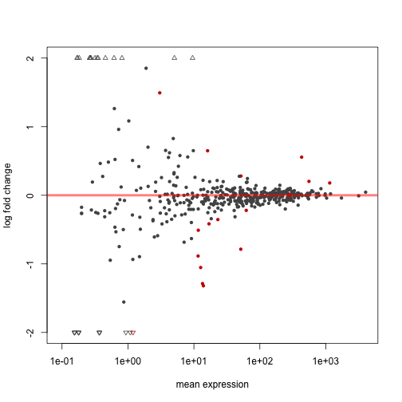
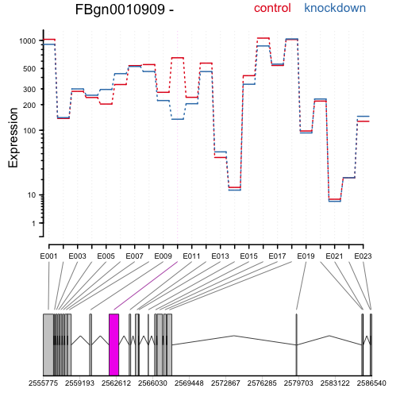
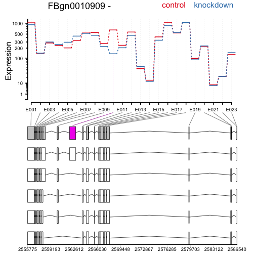

The [DEXSeq](http://bioconductor.org/packages/release/bioc/html/DEXSeq.html) package offers differential testing of exon usage within each gene. Here we will explore the R code used in a *DEXSeq* analysis. We omit the python calls for preparing the annotation and count tables, but these can be found in the vignette at the above link. The python calls are generally along the lines of:

```
python dexseq_prepare_annotation.py gtffile.gtf dexseq.gff
python dexseq_count.py dexseq.gff sample1.sam sample1.txt
```

Once we have repeated the `dexseq_count` script for each sample, we can read the data into R using the code chunks below. As we are working with pre-prepared data, we first point to these files which live within the *pasilla* package. 

The *pasilla* package contains counts from an experiment by [Brooks et al](http://www.ncbi.nlm.nih.gov/pmc/articles/PMC3032923/)

We will run DEXSeq on a subset of the genes, for demonstration purposes.


```r
library("pasilla")
inDir = system.file("extdata", package="pasilla", mustWork=TRUE)
countFiles = list.files(inDir, pattern="fb.txt$", full.names=TRUE)
flattenedFile = list.files(inDir, pattern="gff$", full.names=TRUE)
genesForSubset = read.table(file.path(inDir, "geneIDsinsubset.txt"),
  stringsAsFactors=FALSE)[[1]]
```

As in *DESeq2* we use a `sampleTable` to define the samples:


```r
sampleTable = data.frame(
  row.names = c( "treated1", "treated2", "treated3",
    "untreated1", "untreated2", "untreated3", "untreated4" ),
  condition = c("knockdown", "knockdown", "knockdown",
    "control", "control", "control", "control" ),
  libType = c( "single-end", "paired-end", "paired-end",
    "single-end", "single-end", "paired-end", "paired-end" ) )
sampleTable
```

```
##            condition    libType
## treated1   knockdown single-end
## treated2   knockdown paired-end
## treated3   knockdown paired-end
## untreated1   control single-end
## untreated2   control single-end
## untreated3   control paired-end
## untreated4   control paired-end
```

We now read the data into a `DEXSeqDataSet` object:


```r
library("DEXSeq")
dxd = DEXSeqDataSetFromHTSeq(
  countFiles,
  sampleData=sampleTable,
  design= ~ sample + exon + condition:exon,
  flattenedfile=flattenedFile )
```

Subset the genes, for demonstration purposes:


```r
dxd = dxd[geneIDs( dxd ) %in% genesForSubset,]
```

Now we run the estimation and testing functions:


```r
dxd = estimateSizeFactors( dxd )
dxd = estimateDispersions( dxd )
```

```
## using supplied model matrix
## using supplied model matrix
```

```r
dxd = testForDEU( dxd )
```

```
## using supplied model matrix
```

```r
dxd = estimateExonFoldChanges( dxd, fitExpToVar="condition")
```

The following code extracts a results table, makes an MA-plot, and draws the expression levels over the exons to highlight differential exon usage:


```r
dxr = DEXSeqResults( dxd )
plotMA( dxr, cex=0.8 )
```



```r
plotDEXSeq( dxr, "FBgn0010909", legend=TRUE, cex.axis=1.2, cex=1.3, lwd=2 )
```



Again, drawing the expression levels, now showing the annotated transcripts below:


```r
plotDEXSeq( dxr, "FBgn0010909", displayTranscripts=TRUE, legend=TRUE,
              cex.axis=1.2, cex=1.3, lwd=2 )
```



For more details on the *DEXSeq* software, see the vignette and the paper, which is linked from the vignette page:


```r
browseVignettes("DEXSeq")
```

We conclude by adding the session information:


```r
sessionInfo()
```

```
## R version 3.2.4 (2016-03-10)
## Platform: x86_64-apple-darwin13.4.0 (64-bit)
## Running under: OS X 10.10.5 (Yosemite)
## 
## locale:
## [1] en_US.UTF-8/en_US.UTF-8/en_US.UTF-8/C/en_US.UTF-8/en_US.UTF-8
## 
## attached base packages:
## [1] stats4    parallel  methods   stats     graphics  grDevices utils    
## [8] datasets  base     
## 
## other attached packages:
##  [1] DEXSeq_1.16.10             DESeq2_1.10.1             
##  [3] RcppArmadillo_0.6.600.4.0  Rcpp_0.12.4               
##  [5] SummarizedExperiment_1.0.2 GenomicRanges_1.22.4      
##  [7] GenomeInfoDb_1.6.3         IRanges_2.4.8             
##  [9] S4Vectors_0.8.11           Biobase_2.30.0            
## [11] BiocGenerics_0.16.1        BiocParallel_1.4.3        
## [13] pasilla_0.10.0             knitr_1.12.3              
## 
## loaded via a namespace (and not attached):
##  [1] formatR_1.3          RColorBrewer_1.1-2   futile.logger_1.4.1 
##  [4] plyr_1.8.3           XVector_0.10.0       bitops_1.0-6        
##  [7] futile.options_1.0.0 tools_3.2.4          zlibbioc_1.16.0     
## [10] biomaRt_2.26.1       statmod_1.4.24       rpart_4.1-10        
## [13] RSQLite_1.0.0        annotate_1.48.0      evaluate_0.8.3      
## [16] gtable_0.2.0         lattice_0.20-33      DBI_0.3.1           
## [19] gridExtra_2.2.1      hwriter_1.3.2        genefilter_1.52.1   
## [22] stringr_1.0.0        cluster_2.0.3        Biostrings_2.38.4   
## [25] locfit_1.5-9.1       grid_3.2.4           nnet_7.3-12         
## [28] AnnotationDbi_1.32.3 XML_3.98-1.4         survival_2.38-3     
## [31] foreign_0.8-66       latticeExtra_0.6-28  Formula_1.2-1       
## [34] geneplotter_1.48.0   ggplot2_2.1.0        lambda.r_1.1.7      
## [37] magrittr_1.5         Rsamtools_1.22.0     Hmisc_3.17-3        
## [40] scales_0.4.0         splines_3.2.4        xtable_1.8-2        
## [43] colorspace_1.2-6     stringi_1.0-1        acepack_1.3-3.3     
## [46] RCurl_1.95-4.8       munsell_0.4.3
```

