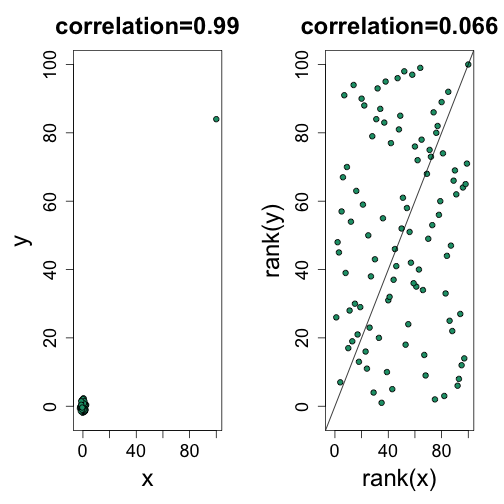

# Introduction

The normal apporximatiion is often useful when analyzing life sciences data. However, due to the complexity of the measurement devices it is also common to mistakenlyobserve data points generated by an undesired process. For example, a defect on a scanner can produce a hanful of very high intensities. Thus we may have situationst that are approximated by a, for example, 99 data points from a standard normal distribution and one very large number.

```r
set.seed(1)
x=c(rnorm(100,0,1)) ##real distribution
x[23] <- 100 ##mistake made in 23th measurement
boxplot(x)
```

 
In statistics we refer these types of points as _outliers_. A small number of outliers can throw of an entire analysis. For example notice how this one point results in the sample mean and sample variace being very far from the 0 and 1 respectively.

```r
mean(x)
```

```
## [1] 1.108142
```

```r
sd(x)
```

```
## [1] 10.02938
```

# The Median

The median, defined as the point having half the data larger and half the data smaller, is a summary statistic that is _robust_ to outliers. Note how much closer the median is to 0, the center of our actual distribution. 

```r
median(x)
```

```
## [1] 0.1684483
```

# The Median Absolute Deviance
The median absolute deviace (MAD) is a robust summary for the standard deviation. It is defined by computing the differences between each point and the median and taking the median of their absolute values:
$$
 1.4826 \mbox{median}\{| X_i - \mbox{median}(X_i)|\}
$$
The number $1.4826$ is a scale factor that guarantees an unbiased 
estimate of the actual center. Notice how much closer we are to one with the mad:

```r
mad(x)
```

```
## [1] 0.8857141
```

## Spearman correlation
Earlier we saw that the correlation is also sensitive to outliers. Here we construct a independent list of numbers but for which a simialr mistake was made for the same entry:


```r
set.seed(1)
x=c(rnorm(100,0,1)) ##real distribution
x[23] <- 100 ##mistake made in 23th measurement
y=c(rnorm(100,0,1)) ##real distribution
y[23] <- 84 ##similar mistake made in 23th measurement
library(rafalib)
mypar(1,1)
plot(x,y,main=paste0("correlation=",round(cor(x,y),3)),pch=21,bg=1,xlim=c(-3,100),ylim=c(-3,100))
abline(0,1)
```

 

The Spearman correlation follows the general idea of median and mad: using quantiles.  The idea is simple: we convert each dataset to ranks an then compute correlation:

```r
mypar(1,2)
plot(x,y,main=paste0("correlation=",round(cor(x,y),3)),pch=21,bg=1,xlim=c(-3,100),ylim=c(-3,100))
plot(rank(x),rank(y),main=paste0("correlation=",round(cor(x,y,method="spearman"),3)),pch=21,bg=1,xlim=c(-3,100),ylim=c(-3,100))
abline(0,1)
```

 


So if these statistics are robust to outliers, why would we ever use the non-robust version? In general, if we know there are outliers then median and mad are recommended over the mean and standard devtiaion conterparts. However, in the inference modules we learn of an example in which robust statistics are less powerful than the non-robust versions.

We also note that there is a [large statistical literature](#foot) on Robust Statistics that go far beyond the median and the mad.

# Symmetry of log ratios


# Ratios are not symmetric


Reporting ratios or fold changes are common in the life science. Suppose you are studying ratio data showing, say, gene expression before and after treatment. You are given ratio data so values larger than 1 mean gene expression was higher after the treatment. If the treatment has no effect we should see as many value below 1 as above 1. A histogram seems to suggest that the treatment does in fact have an effect:


```r
hist(ratios)
```

 

The problem here is that ratios are not symmetric around 1. For example 1/32 is much closer to 1 than 32/1. Taking logs takes care of this problem.


```r
logratios <- log2(ratios)
hist(logratios)
```

 

The log of ratios are of course symmetric around 0 because

$$\log(x/y) = \log(x)-\log(y) = -(\log(y)-\log(x)) = \log(y/x)$$

As demonstrated by these simple plots:

```r
x <- 2^(-5:5) ##this 1/32,1/16,1/8,...,1,2,...,32
mypar2(1,2)
plot(x)
abline(h=1)
plot(log2(x))
abline(h=0)
```

 


The log transformation is also commonly used because fold changes are the most widely used quantification of interest. Note that a fold change of 100 can be a ratio of 100/1 or 1/100. However, 1/100 is much closer to 1 (no fold change) than 100: ratios are not symmetric about 1.

```r
x=2^seq(1,5)
y=c(rev(1/x),1,x)
Names=c(paste0("1/",rev(x)),1,x)
mypar(1,1)
plot(seq(along=y),y,xlab="",ylab="",type="n",xaxt="n")
text(seq(along=y),y,Names,cex=1.5)
abline(h=1)
```

 

```r
plot(seq(along=y),y,xlab="",ylab="",type="n",log="y",xaxt="n")
text(seq(along=y),y,Names,cex=1.5)
abline(h=1)
```

 

## Footnotes <a name="foot"></a>

### Robust statistics

Robust Statistics, Peter. J. Huber and Elvezio M. Ronchetti, Wiley, 2009.
Introduction to Robust Estimation and Hypothesis Testing, Rand R. Wilcox, 2012.
Robust Statistics: The Approach Based on Influence Functions, Frank R. Hampel, Elvezio M. Ronchetti, Peter J. Rousseeuw, Werner A. Stahel

