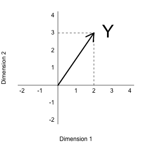
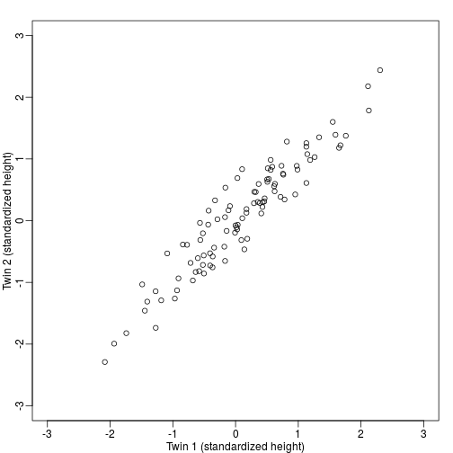
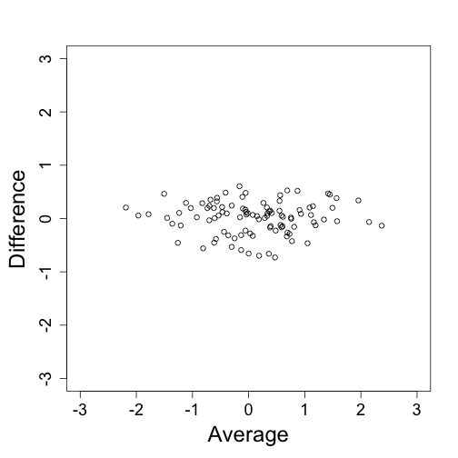

# Introduction
One of the most useful applications of projections relates to coordinate rotations. In data analysis, simple rotations can result in easier to visualize and interpreter data. We will described the mathematics behind rotations and give some data analysis examples.
 
In our previous section we used the following example: 
$$
\begin{aligned}
Y &= \begin{pmatrix} 2 \\ 3\end{pmatrix} \\
&=2  \begin{pmatrix} 1\\ 0\end{pmatrix} + 3 \begin{pmatrix} 0\\ 1\end{pmatrix} 
\end{aligned}$$

and noted that $$2$$ and $$3$$ are the _coordinates_


```r
library(rafalib)
```

```
## Loading required package: RColorBrewer
```

```r
mypar2(1,1)
plot(c(-2,4),c(-2,4),xlab="Dimension 1",ylab="Dimension 2",type="n",xaxt="n",yaxt="n",bty="n")
text(rep(0,6),c(c(-2,-1),c(1:4)),as.character(c(c(-2,-1),c(1:4))),pos=2)
text(c(c(-2,-1),c(1:4)),rep(0,6),as.character(c(c(-2,-1),c(1:4))),pos=1)
abline(v=0,h=0)
arrows(0,0,2,3,lwd=3)
segments(2,0,2,3,lty=2)
segments(0,3,2,3,lty=2)
text(2,3," Y",pos=4,cex=3)
```



But note that, mathematically, we can represent the point $$(2,3)$$ with other linear combinations:

$$
\begin{aligned}
Y &= \begin{pmatrix} 2 \\ 3\end{pmatrix} \\
&= 2.5 \begin{pmatrix} 1\\ 1\end{pmatrix} + -1 \begin{pmatrix} \phantom{-}0.5\\ -0.5\end{pmatrix} 
\end{aligned}$$

The new coordinates are:

$$Z = \begin{pmatrix} 2.5 \\ -1 \end{pmatrix}$$

Graphically we can see that the coordinates are the projections to the spaces defined by the new basis:


```r
library(rafalib)
mypar2(1,1)
plot(c(-2,4),c(-2,4),xlab="Dimension 1",ylab="Dimension 2",type="n",xaxt="n",yaxt="n",bty="n")
text(rep(0,6),c(c(-2,-1),c(1:4)),as.character(c(c(-2,-1),c(1:4))),pos=2)
text(c(c(-2,-1),c(1:4)),rep(0,6),as.character(c(c(-2,-1),c(1:4))),pos=1)
abline(v=0,h=0)
abline(0,1,col="red")
abline(0,-1,col="red")
arrows(0,0,2,3,lwd=3)
y=c(2,3)
x1=c(1,1)##new basis
x2=c(0.5,-0.5)##new basis
c1 = crossprod(x1,y)/crossprod(x1)
c2 = crossprod(x2,y)/crossprod(x2)
segments(x1[1]*c1,x1[2]*c1,y[1],y[2],lty=2)
segments(x2[1]*c2,x2[2]*c2,y[1],y[2],lty=2)
text(2,3," Y",pos=4,cex=3)
```


# Rotations

We can go back and forth between these two representations of $$(2,3)$$ using matrix multiplication.

$$
Y =   AZ\\
$$

$$
 A^{-1} Y =  Z\\
$$

$$
A= \begin{pmatrix} 1& \phantom{-}0.5\\ 1 & -0.5\end{pmatrix} \implies
A^{-1}= \begin{pmatrix} 0.5& 0.5 \\ 1 &-1\end{pmatrix}
$$

$$Z$$ and $$Y$$ carry the same information but in different _coordinate system_

# Example: twin Heights

Here are 100 two dimensional points $$Y$$



Here are the rotations: $$Z = A^{-1} Y$$




Note that what we have done here is change rotate the data so that the first coordinate of $$Z$$ is the average height while the second is the differences between twin heights. 

In the following sections we will be using the singular value decomposition to find principal components. It is sometimes useful to think of the SVD as a rotation, for example, $$U^\topY$$ that gives us a new coordiante system $$DV^\top$$ in which the dimensions are ordered by how much variance they explain. 


