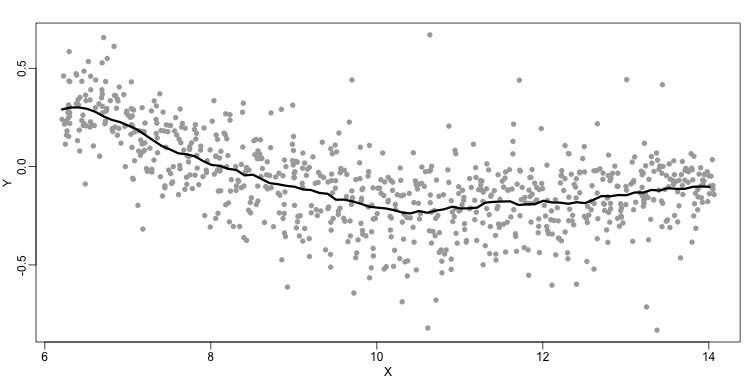

<a name="smoothing"></a>

## Smoothing 

The R markdown document for this section is available [here](https://github.com/genomicsclass/labs/tree/master/ml/smoothing.Rmd).

Smoothing is a very powerful technique used all across data analysis. The general idea is to group data points that are expected to have similar expectations and [RAFA]

The following data are from measurements from replicated RNA. We consider the data used in an MA-plot ( {$$}Y{/$$} = log ratios and {$$}A{/$$} = averages) and take down-sample in a way that balances the number of points for different strata of {$$}A{/$$}:


```r
##Following three packages are available from Bioconductor
library(Biobase)
library(SpikeIn)
library(hgu95acdf)

data(SpikeIn95)

##Example with two columns
i=10;j=9

##remove the spiked in genes and take random sample
siNames<-colnames(pData(SpikeIn95))
ind <- which(!probeNames(SpikeIn95)%in%siNames)
pms <- pm(SpikeIn95)[ ind ,c(i,j)]

##pick a representative sample for A and order A
Y=log2(pms[,1])-log2(pms[,2])
X=(log2(pms[,1])+log2(pms[,2]))/2
set.seed(4)
ind <- tapply(seq(along=X),round(X*5),function(i)
  if(length(i)>20) return(sample(i,20)) else return(NULL))
ind <- unlist(ind)
X <- X[ind]
Y <- Y[ind]
o <-order(X)
X <- X[o]
Y <- Y[o]
```

In the MA plot we see that {$$}Y{/$$} depends on {$$}X{/$$}. This dependence must be a bias because these are based on replicates which means {$$}Y{/$$} should be 0 on average regardless of {$$}X{/$$}. We want to predict {$$}f(x)=\mbox{E}(Y \mid X=x){/$$} so that we can remove this bias.


```r
library(rafalib)
mypar()
plot(X,Y)
```

 

Linear regression does not capture the apparent curvature in {$$}f(x){/$$}:


```r
mypar()
plot(X,Y)
fit <- lm(Y~X)
points(X,Y,pch=21,bg=ifelse(Y>fit$fitted,1,3))
abline(fit,col=2,lwd=4,lty=2)
```

 

Note that the points above the fitted line (green) and those below (purple) are not evenly distributed.

## Bin Smoothing

The R markdown document for this section is available [here](https://github.com/genomicsclass/labs/tree/master/ml/smoothing.Rmd).

Instead of fitting a line, let's go back to the idea of stratifying and computing the mean. This is referred to as _bin smoothing_. Now, if we stratify by {$$}x{/$$} , the general idea is that the underlying curve is "smooth" enough that in small bins it is approximately constant, which implies that all the {$$}Y{/$$} in that bin have the same expected value. For example, in the plot below we highlight points in a bin centered at 8.6 as well as the points of a bin centered at 12.1 if we use bins of size 1. We also show and the fitted mean values for the {$$}Y{/$$} in those bin (dashed lines):


```r
mypar()
centers <- seq(min(X),max(X),0.1)
plot(X,Y,col="grey",pch=16)
windowSize <- .5
i <- 25
center<-centers[i]
ind=which(X>center-windowSize & X<center+windowSize)
fit<-mean(Y)
points(X[ind],Y[ind],bg=3,pch=21)
lines(c(min(X[ind]),max(X[ind])),c(fit,fit),col=2,lty=2,lwd=4)
i <- 60
center<-centers[i]
ind=which(X>center-windowSize & X<center+windowSize)
fit<-mean(Y[ind])
points(X[ind],Y[ind],bg=3,pch=21)
lines(c(min(X[ind]),max(X[ind])),c(fit,fit),col=2,lty=2,lwd=4)
```

 

By computing this mean for bins around every point we form an estimate of the underlying curve {$$}f(x){/$$} :


```r
windowSize<-0.5
smooth<-rep(NA,length(centers))
mypar (4,3)
for(i in seq(along=centers)){
  center<-centers[i]
  ind=which(X>center-windowSize & X<center+windowSize)
  smooth[i]<-mean(Y[ind])
  if(i%%round(length(centers)/12)==1){ ##we show 12
    plot(X,Y,col="grey",pch=16)
    points(X[ind],Y[ind],bg=3,pch=21)
    lines(c(min(X[ind]),max(X[ind])),c(smooth[i],smooth[i]),col=2,lwd=2)
    lines(centers[1:i],smooth[1:i],col="black")
    points(centers[i],smooth[i],col="black",pch=16,cex=1.5)
  }
}
```

 

The final result looks like this:


```r
mypar (1,1)
plot(X,Y,col="darkgrey",pch=16)
lines(centers,smooth,col="black",lwd=3)
```

 


## Loess

The R markdown document for this section is available [here](https://github.com/genomicsclass/labs/tree/master/ml/smoothing.Rmd).
 
Local weighted regression (loess) is similar to bin smoothing. The difference is that we approximate the local behavior with a line or a parabola. This permits us to expand the bin sizes as seen below:


```r
centers <- seq(min(X),max(X),0.1)
mypar (1,1)
plot(X,Y,col="darkgrey",pch=16)
windowSize <- 1.25

i <- 25
center<-centers[i]
ind=which(X>center-windowSize & X<center+windowSize)
fit<-lm(Y~X,subset=ind)
points(X[ind],Y[ind],bg=3,pch=21)
a <- min(X[ind]);b <- max(X[ind])
lines(c(a,b),fit$coef[1]+fit$coef[2]*c(a,b),col=2,lty=2,lwd=3)

i <- 60
center<-centers[i]
ind=which(X>center-windowSize & X<center+windowSize)
fit<-lm(Y~X,subset=ind)
points(X[ind],Y[ind],bg=3,pch=21)
a <- min(X[ind]);b <- max(X[ind])
lines(c(a,b),fit$coef[1]+fit$coef[2]*c(a,b),col=2,lty=2,lwd=3)
```

 

Here are 12 steps of the process:

```r
mypar (4,3)
windowSize<-1.25
smooth<-rep(NA,length(centers))
for(i in seq(along=centers)){
  center<-centers[i]
  ind=which(X>center-windowSize & X<center+windowSize)
  fit<-lm(Y~X,subset=ind)
  smooth[i]<-fit$coef[1]+fit$coef[2]*center

  if(i%%round(length(centers)/12)==1){ ##we show 12
    plot(X,Y,col="grey",pch=16)
    points(X[ind],Y[ind],bg=3,pch=21)
    a <- min(X[ind]);b <- max(X[ind])
    lines(c(a,b),fit$coef[1]+fit$coef[2]*c(a,b),col=2,lwd=2)
  
    lines(centers[1:i],smooth[1:i],col="black")
    points(centers[i],smooth[i],col="black",pch=16,cex=1.5)
  }
}
```

 

This results in a smoother fit since we use larger sample sizes to estimate our local parameters:


```r
mypar (1,1)
plot(X,Y,col="darkgrey",pch=16)
lines(centers,smooth,col="black",lwd=3)
```

 

The function `loess` performs this analysis for us:


```r
fit <- loess(Y~X, degree=1, span=1/3)

newx <- seq(min(X),max(X),len=100) 
smooth <- predict(fit,newdata=data.frame(X=newx))

mypar ()
plot(X,Y,col="darkgrey",pch=16)
lines(newx,smooth,col="black",lwd=3)
```

 

