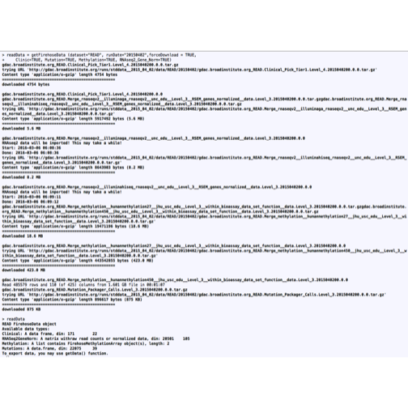
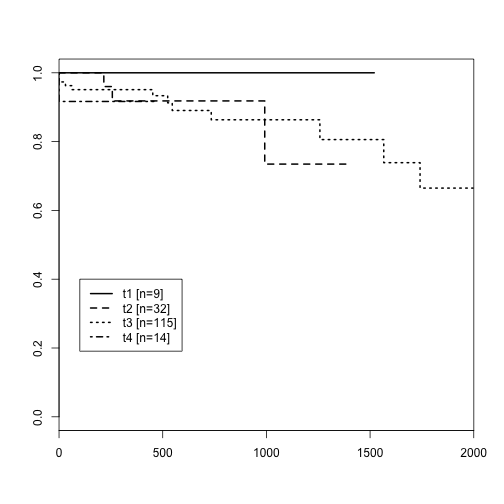
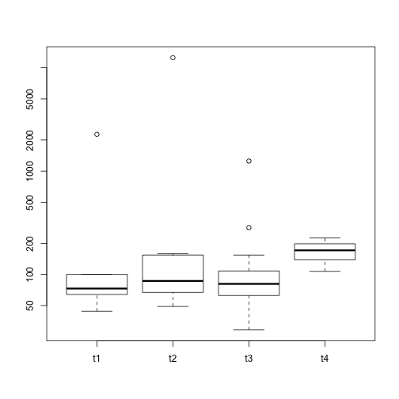
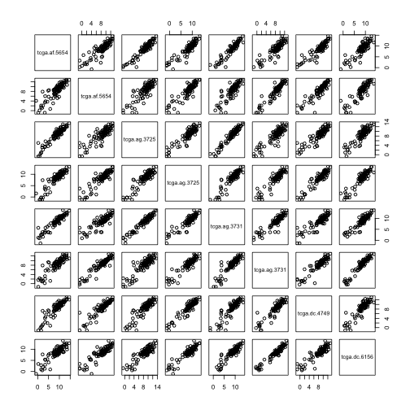
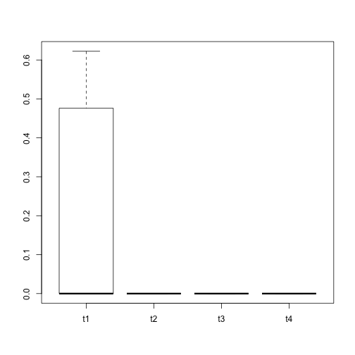
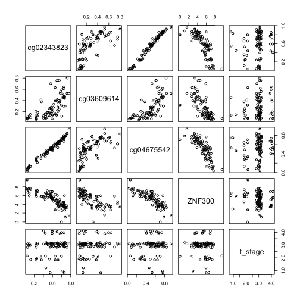

## Introduction

TCGA, [The Cancer Genome Atlas](http://cancergenome.nih.gov/), assembles
multi-omic data on many tumor samples.

We will discuss how to work with data
acquired using the [RTCGAToolbox](http://journals.plos.org/plosone/article?id=10.1371/journal.pone.0106397)
 package.  A substantial part of the
effort of illustrating this system resides in the downloading
of large resources from the archive.  The vignette for the toolbox
package describes high-level utilities for analysis; here we'll focus
on data harmonization and manual analysis.

Here's an illustration of the download effort for three data types in
rectal adenoma:


```r
library(ph525x)
firehose()
```



<a name="firehose"></a>

## The integrative object

We used the commands


```r
library(RTCGAToolbox)
readData = getFirehoseData (dataset="READ", runDate="20150402",forceDownload = TRUE,
    Clinic=TRUE, Mutation=TRUE, Methylation=TRUE, RNASeq2GeneNorm=TRUE)
```


which takes about 10 minutes to acquire and save on a good wireless connection.
The show method for the object prints


```r
readData
```

```
## READ FirehoseData objectStandard run date: 20150402 
## Analysis running date: 20160128 
## Available data types: 
##   clinical: A data frame of phenotype data, dim:  171 x 22 
##   RNASeq2GeneNorm: A matrix of count or normalized data, dim:  20501 x 105 
##   Methylation: A list of FirehoseMethylationArray object(s), length:  2 
##   GISTIC: A FirehoseGISTIC for copy number data 
##   Mutation: A data.frame, dim:  22075 x 39 
## To export data, use the 'getData' function.
```

and hides the dimensionalities of the two methylation assays.  These
can be found via

```
> lapply(readData@Methylation, function(x) dim(x@DataMatrix))
[[1]]
[1] 27578    76

[[2]]
[1] 485577    109
```

<a name="clinical"></a>

## A view of the clinical data

A complete understanding of the dataset would require attention to the
method by which the "cohort" of tumors was assembled, including
establishment of a common time origin for disease progression or death event times,
along with details on tumor
sampling and assay procedures.  For the purposes of this course, we'll
assume that we can meaningfully combine all the data that we've retrieved.

<a name="severity"></a>

### Selecting a severity measure

```r
clin = getData(readData, "clinical")
names(clin)
```

```
##  [1] "Composite Element REF"                 
##  [2] "years_to_birth"                        
##  [3] "vital_status"                          
##  [4] "days_to_death"                         
##  [5] "days_to_last_followup"                 
##  [6] "primary_site_of_disease"               
##  [7] "neoplasm_diseasestage"                 
##  [8] "pathology_T_stage"                     
##  [9] "pathology_N_stage"                     
## [10] "pathology_M_stage"                     
## [11] "dcc_upload_date"                       
## [12] "gender"                                
## [13] "date_of_initial_pathologic_diagnosis"  
## [14] "days_to_last_known_alive"              
## [15] "radiation_therapy"                     
## [16] "histological_type"                     
## [17] "radiations_radiation_regimenindication"
## [18] "completeness_of_resection"             
## [19] "number_of_lymph_nodes"                 
## [20] "race"                                  
## [21] "ethnicity"                             
## [22] "batch_number"
```

The severity of the disease will be indicated in pathology variables.
T staging refers to size and invasiveness of tumor, N staging refers
to presence of cancer cells in various lymph nodes.


```r
with(clin, table(pathology_T_stage, pathology_N_stage))
```

```
##                  pathology_N_stage
## pathology_T_stage n0 n1 n1a n1b n1c n2 n2a n2b nx
##               t1   8  1   0   0   0  0   0   0  0
##               t2  28  3   0   1   0  0   0   0  0
##               t3  49 30   3   4   1 22   2   2  2
##               t4   2  1   0   0   0  2   0   0  0
##               t4a  1  1   0   0   0  1   0   5  0
##               t4b  0  0   0   0   0  0   1   0  0
```

We see that there is variability in both staging measures.  We'll
reduce the T staging to avoid small class sizes.


```r
clin$t_stage = factor(substr(clin$pathology_T_stage,1,2))
table(clin$t_stage)
```

```
## 
##  t1  t2  t3  t4 
##   9  32 115  14
```

<a name="survival"></a>

### Defining survival times

We'll guess that the vital status variable corresponds to status
at last followup and that the days to last followup are recorded
from a common origin in the diagnostic process.  Patient presents,
tumor is graded and staged, and the followup calendar begins.

The following Kaplan-Meier display is a crude sanity check, showing
that tumor stage 1 has no observed events, stages 2 and 3 are ordered
as we would expect for the first 1000 days or so, and then the
curves cross; the data are sparse.


```r
library(survival)
ev = 1*(clin$vital == 1)
fut = as.numeric(clin$days_to_last_followup)
su = Surv(fut, ev)
plot(survfit(su~t_stage, data=clin), lwd=2, lty=1:4, xlim=c(0,2000))
ntab = table(clin$t_stage)
ns = paste("[n=", ntab, "]", sep="")
legend(100, .4, lty=1:4, lwd=2, legend=paste(levels(clin$t_stage), ns))
```



<a name="mutation"></a>

### Introducing mutation data


```r
mut = getData(readData, "Mutation")
dim(mut)
```

```
## [1] 22075    39
```

```r
table(mut$Variant_Classification)
```

```
## 
##                    3'UTR                  5'Flank                    5'UTR 
##                       11                        3                       14 
##    De_novo_Start_InFrame De_novo_Start_OutOfFrame          Frame_Shift_Del 
##                        4                       31                      176 
##          Frame_Shift_Ins                      IGR             In_Frame_Del 
##                      161                       24                       30 
##             In_Frame_Ins                   Intron        Missense_Mutation 
##                        8                      132                    14767 
##        Nonsense_Mutation         Nonstop_Mutation             Read-through 
##                     1964                        6                       10 
##                      RNA                   Silent              Splice_Site 
##                       16                     4675                       43
```

Let's order genes by the number of missense or nonsense mutations
recorded.


```r
gt = table(mut$Hugo, mut$Variant_Classification)
mn = apply(gt[,12:13], 1, sum)
omn = order(mn, decreasing=TRUE)
gt[omn[1:20], c(12:13,17,18)]
```

```
##         
##          Missense_Mutation Nonsense_Mutation Silent Splice_Site
##   TTN                   79                 8     20           0
##   APC                    9                65      0           1
##   TP53                  33                 8      1           1
##   KRAS                  37                 1      0           0
##   MUC16                 31                 2     12           0
##   SYNE1                 21                 2      6           0
##   DNAH10                19                 1      2           0
##   DNAH5                 18                 2      2           0
##   LRP1B                 19                 1      4           0
##   ABCA13                17                 0      1           0
##   NEB                   14                 3      2           0
##   ZFHX4                 16                 1      5           0
##   AHNAK2                15                 1      1           0
##   FAT4                  16                 0      5           0
##   HMCN1                 14                 2      1           0
##   HYDIN                 13                 3      5           0
##   PCLO                  13                 3      4           0
##   PKHD1                 16                 0      0           0
##   SACS                  15                 1      4           0
##   DNAH11                12                 2      4           0
```

The fact that KRAS and TP53 are in this list gives another
crude sanity check.  

<a name="curation"></a>

## Multiomics 101: Can we combine the mutation and clinical data?

It isn't straightforward because sample identifiers are not shared.


```r
clin[1:4,1:3]
```

```
##              Composite Element REF years_to_birth vital_status
## tcga.af.2687                 value             57            0
## tcga.af.2689                 value             41            1
## tcga.af.2690                 value             76            1
## tcga.af.2691                 value             48            0
```

```r
mut[1:4,c(1,16)]
```

```
##   Hugo_Symbol         Tumor_Sample_Barcode
## 1      OR5B12 TCGA-AG-3586-01A-02W-0831-10
## 2       KRT17 TCGA-AG-3586-01A-02W-0831-10
## 3     SLC10A4 TCGA-AG-3586-01A-02W-0831-10
## 4     C7orf58 TCGA-AG-3586-01A-02W-0831-10
```

We'll guess that the following transformation produces the appropriate
identifier for the mutation data.


```r
mid = tolower(substr(mut[,16],1,12))
mid = gsub("-", ".", mid)
mean(mid %in% rownames(clin))
```

```
## [1] 1
```

```r
mut$sampid = mid
```

Let's simply summarize the total mutation burden per individual.

```r
nmut = sapply(split(mut$sampid, mut$sampid),length)
nmut[1:4]
```

```
## tcga.af.2689 tcga.af.2691 tcga.af.2692 tcga.af.3400 
##           64           73           45           33
```

```r
length(nmut)
```

```
## [1] 69
```

```r
dim(clin)
```

```
## [1] 171  23
```

We see that not all individuals with clinical data had a mutation study.
We'll subset the clinical data and visualize the distribution of
mutation counts by tumor stage.


```r
clinwmut = clin[names(nmut),]
clinwmut$nmut = nmut
with(clinwmut, boxplot(split(nmut, t_stage), log="y"))
```



<a name="expression"></a>

## The expression data

There is no experiment-level metadata shipped with the
data, but we understand that this is illumina hiseq
RNA-sequencing with transcript abundance estimation via RSEM.
How the data were transformed to gene level needs to be
investigated.


```r
rnaseq = getData(readData, "RNASeq2GeneNorm")
rnaseq[1:4,1:4]
```

```
##       TCGA-AF-2687-01A-02R-1736-07 TCGA-AF-2689-11A-01R-A32Z-07
## A1BG                       20.1873                      43.4263
## A1CF                       51.0856                     313.3531
## A2BP1                       0.4257                      18.9911
## A2LD1                      90.2639                      92.2611
##       TCGA-AF-2690-01A-02R-1736-07 TCGA-AF-2691-11A-01R-A32Z-07
## A1BG                       56.4619                      35.9451
## A1CF                       24.9913                     218.1571
## A2BP1                       0.9256                      22.6758
## A2LD1                     164.3365                     113.6528
```

Again we'll have to transform the sample identifier strings.


```r
rid = tolower(substr(colnames(rnaseq),1,12))
rid = gsub("-", ".", rid)
mean(rid %in% rownames(clin))
```

```
## [1] 1
```

```r
colnames(rnaseq) = rid
```

Sadly there is not much overlap between mutation and expression data.


```r
intersect(rid,mid)
```

```
## [1] "tcga.af.2689" "tcga.af.2691" "tcga.af.2692" "tcga.af.3400"
## [5] "tcga.ag.3902"
```

We note some duplicated transformed identifiers; it is not obvious
which of the duplicates to keep, so we drop the second.


```r
which(duplicated(colnames(rnaseq)))
```

```
## [1]  11  21  23  25  27  35 104
```

```r
pairs(log2(rnaseq[101:200,c(10:11,20,21,22,23,50,55)]))
```



```r
rnaseq = rnaseq[,-which(duplicated(colnames(rnaseq)))]
```

Let's create an ExpressionSet:


```r
library(Biobase)
readES = ExpressionSet(log2(rnaseq+1))
pData(readES) = clin[sampleNames(readES),]
readES
```

```
## ExpressionSet (storageMode: lockedEnvironment)
## assayData: 20501 features, 98 samples 
##   element names: exprs 
## protocolData: none
## phenoData
##   sampleNames: tcga.af.2687 tcga.af.2689 ... tcga.g5.6641 (98
##     total)
##   varLabels: Composite Element REF years_to_birth ... t_stage (23
##     total)
##   varMetadata: labelDescription
## featureData: none
## experimentData: use 'experimentData(object)'
## Annotation:
```

There is one individual here with missing tumor stage, and
we will simply eliminate that individual.


```r
readES = readES[,-97]
```

<a name="tstageToExpr"></a>

## Relating tumor stage to gene expression variation

We'll use a very crude categorical approach and an
alternative will be explored in exercises.  We'll use moderated F tests
to test the null hypothesis of common mean expression
across tumor stages.


```r
library(limma)
```

```
## 
## Attaching package: 'limma'
```

```
## The following object is masked from 'package:BiocGenerics':
## 
##     plotMA
```

```r
mm = model.matrix(~t_stage, data=pData(readES))
f1 = lmFit(readES, mm)
ef1 = eBayes(f1)
```

```
## Warning: Zero sample variances detected, have been offset away from zero
```

```r
topTable(ef1, 2:4)
```

```
##               t_staget2  t_staget3  t_staget4    AveExpr         F
## LOC100128977 -0.2196981 -0.2196981 -0.2196981 0.01132465 16.060640
## CELA2B       -0.4924981 -0.4856924 -0.3966889 0.04003472 14.236630
## GDEP         -0.9003575 -0.8376533 -0.8484637 0.09571759 11.852702
## FOLR4        -0.6721456 -0.5992014 -0.5847564 0.09479200 10.805454
## C18orf26     -0.3168032 -0.3042073 -0.3168032 0.02516016 10.417589
## GFRA4        -0.2622521 -0.3289370 -0.3481737 0.04383371 10.269518
## TAS2R41      -0.2117273 -0.2051461 -0.2117273 0.01552745 10.213776
## SEMA5B        1.7503244  1.7161443  2.4269386 4.52996758  9.131087
## CTRB2        -1.5604625 -1.5221324 -1.3959781 0.15557817  8.983471
## TXNDC17      -0.7046034 -0.9283568 -1.4545590 9.81107126  8.216157
##                   P.Value    adj.P.Val
## LOC100128977 1.660698e-08 0.0003404596
## CELA2B       1.010504e-07 0.0010358169
## GDEP         1.187769e-06 0.0081168181
## FOLR4        3.647543e-06 0.0186945693
## C18orf26     5.561914e-06 0.0203603949
## GFRA4        6.539887e-06 0.0203603949
## TAS2R41      6.951991e-06 0.0203603949
## SEMA5B       2.311338e-05 0.0592309205
## CTRB2        2.728557e-05 0.0621535018
## TXNDC17      6.519177e-05 0.1336496376
```


```r
boxplot(split(exprs(readES)["LOC100128977",], readES$t_stage))
```



<a name="methy"></a>

## Introducing the 450k methylation data

The 450k data has
complicating conditions in common with the expression data -- identifiers
in need of transformation, duplicates, and only partial match to clinical data.


```r
me450k = getData(readData, "Methylation", 2)
fanno = me450k[,1:3]
me450k = data.matrix(me450k[,-c(1:3)])
med = tolower(substr(colnames(me450k),1,12))
med = gsub("-", ".", med)
mean(med %in% rownames(clin))
```

```
## [1] 1
```

```r
sum(duplicated(med))
```

```
## [1] 8
```

```r
todrop = which(duplicated(med))
me450k = me450k[,-todrop]
med = med[-todrop]
colnames(me450k) = med
ok = intersect(rownames(clin), colnames(me450k))
me450kES = ExpressionSet(me450k[,ok])
pData(me450kES) = clin[ok,]
fData(me450kES) = fanno
me450kES = me450kES[,-which(is.na(me450kES$t_stage))]
```

Do the 450k measures of DNA methylation associated with gene g correlate with
variation of expression of g?  We need to synchronize the two datasets.


```r
ok = intersect(sampleNames(me450kES), sampleNames(readES))
meMatch = me450kES[,ok]
esMatch = readES[,ok]
```

Given these definitions, we can write a helper function


```r
corv = function (sym, mpick = 3) 
{
    mind = which(fData(meMatch)[, 1] == sym)
    if (length(mind) > mpick) 
        mind = mind[1:mpick]
    eind = which(featureNames(esMatch) == sym)
    dat = cbind(t(exprs(meMatch)[mind, , drop = FALSE]), t(exprs(esMatch)[eind, 
        , drop = FALSE]), t_stage = jitter(as.numeric(esMatch$t_stage)))
    bad = apply(dat, 2, function(x) all(is.na(x)))
    if (any(bad)) 
        dat = dat[, -which(bad)]
    pairs(dat)
}
corv("ZNF300")  # learned about it from firebrowse.org
```



## Conclusions

TCGA is an obvious candidate for infrastructure development to support
multiomic analysis.  
The *[MultiAssayExperiment](http://bioconductor.org/packages/MultiAssayExperiment)* and
*[curatedTCGAData](http://bioconductor.org/packages/curatedTCGAData)* packages are recent
contributions that address this task.
We have seen some of the challenges that arise
when even a nicely developed tool like RTCGAToolbox is used to acquire the data:
we must be alert to mismatched sample identifier labels, missing data,
inadequate documentation of sample provenance and assay conduct, and so on.
Human effort is invariably required; standards for data quality must go beyond
numerical accuracy and address transparency and usability.
The curatedTCGAData package does employ manually curated
representations, so that the harmonization tasks demonstrated
in this section are not necessary.  But in general we need to
know how to harmonize, so these tasks are retained in this course.

By suitably varying code snippets in this document, you can get access
to multiomic data of additional modalities (including microRNA, copy number
variation, and proteomics).  As you discover new approaches to interpreting
these measures to create biological insight, please communicate them to the
world by adding packages or workflows to Bioconductor.


