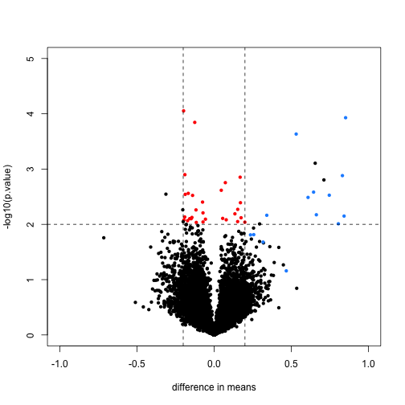
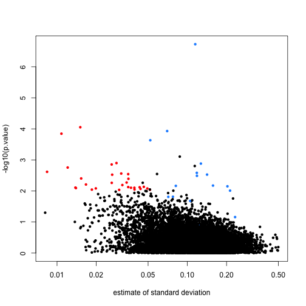
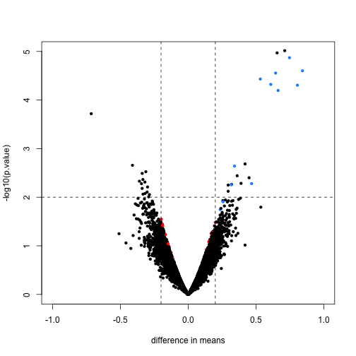

# Using limma for microarray analysis

Here we provide the code shown in the video

```r
biocLite("SpikeInSubset")
```

```
## Error in eval(expr, envir, enclos): could not find function "biocLite"
```

```r
library(SpikeInSubset)
```

```
## Loading required package: Biobase
## Loading required package: BiocGenerics
## Loading required package: methods
## Loading required package: parallel
## 
## Attaching package: 'BiocGenerics'
## 
## The following objects are masked from 'package:parallel':
## 
##     clusterApply, clusterApplyLB, clusterCall, clusterEvalQ,
##     clusterExport, clusterMap, parApply, parCapply, parLapply,
##     parLapplyLB, parRapply, parSapply, parSapplyLB
## 
## The following object is masked from 'package:stats':
## 
##     xtabs
## 
## The following objects are masked from 'package:base':
## 
##     anyDuplicated, append, as.data.frame, as.vector, cbind,
##     colnames, do.call, duplicated, eval, evalq, Filter, Find, get,
##     intersect, is.unsorted, lapply, Map, mapply, match, mget,
##     order, paste, pmax, pmax.int, pmin, pmin.int, Position, rank,
##     rbind, Reduce, rep.int, rownames, sapply, setdiff, sort,
##     table, tapply, union, unique, unlist, unsplit
## 
## Welcome to Bioconductor
## 
##     Vignettes contain introductory material; view with
##     'browseVignettes()'. To cite Bioconductor, see
##     'citation("Biobase")', and for packages 'citation("pkgname")'.
## 
## Loading required package: affy
```

```r
data(rma95)
library(genefilter)
```

```
## 
## Attaching package: 'genefilter'
## 
## The following object is masked from 'package:base':
## 
##     anyNA
```

```r
fac <- factor(rep(1:2,each=3))
tt <- rowttests(exprs(rma95),fac)
mask <- with(tt, abs(dm) < .2 & p.value < .01)
spike <- rownames(rma95) %in% colnames(pData(rma95))
cols <- ifelse(mask,"red",ifelse(spike,"dodgerblue","black"))

with(tt, plot(-dm, -log10(p.value), cex=.8, pch=16,
     xlim=c(-1,1), ylim=c(0,5),
     xlab="difference in means",
     col=cols))
abline(h=2,v=c(-.2,.2), lty=2)
```

 

```r
tt$s <- apply(exprs(rma95), 1, function(row) sqrt(.5 * (var(row[1:3]) + var(row[4:6]))))
with(tt, plot(s, -log10(p.value), cex=.8, pch=16,
              log="x",xlab="estimate of standard deviation",
              col=cols))
```

 

```r
library(limma)
```

```
## 
## Attaching package: 'limma'
## 
## The following object is masked from 'package:BiocGenerics':
## 
##     plotMA
```

```r
fit <- lmFit(rma95, model.matrix(~ fac))
ebfit <- ebayes(fit)
limmares <- data.frame(dm=coef(fit)[,"fac2"], p.value=ebfit$p.value[,"fac2"])
with(limmares, plot(dm, -log10(p.value),cex=.8, pch=16,
     col=cols,xlab="difference in means",
     xlim=c(-1,1), ylim=c(0,5)))
abline(h=2,v=c(-.2,.2), lty=2)
```

 

```r
n <- 40
qs <- seq(from=0,to=.2,length=n)
idx <- sapply(seq_len(n),function(i) which(as.integer(cut(tt$s^2,qs)) == i)[1])
idx <- idx[!is.na(idx)]
par(mar=c(5,5,2,2))
plot(1,1,xlim=c(0,.21),ylim=c(0,1),type="n",
     xlab="variance estimates",ylab="",yaxt="n")
axis(2,at=c(.1,.9),c("before","after"),las=2)
segments((tt$s^2)[idx],rep(.1,n),
         ebfit$s2.post[idx],rep(.9,n))
```

 
