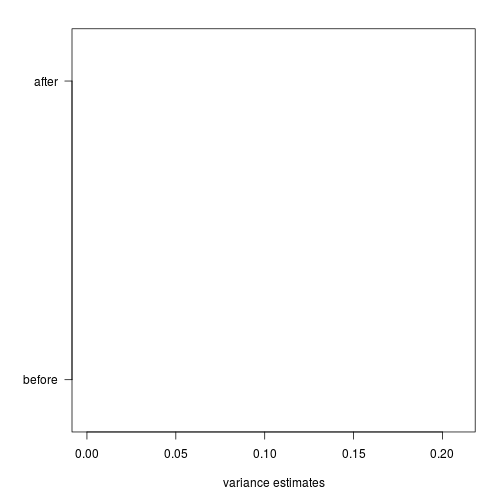

## First, simple t-tests

In this unit, we will show the difference between using the simple t-test and doing differential expression with the `limma` hierarchical model. The reference is [Smyth 2004](#foot), listed in the footnotes.

Here we also show the basic steps for performing a `limma` analysis. Note that the `limma` package is very powerful, and has hundreds of pages of documentation which we cannot cover in this course, however we recommend that users wanting to explore further should check out this guide.

We start by loading the spike-in data which was introduced in lecture, which has already been normalized.


```r
# biocLite("SpikeInSubset")
library(SpikeInSubset)
```

```
## Error in library(SpikeInSubset): there is no package called 'SpikeInSubset'
```

```r
data(rma95)
```

```
## Warning in data(rma95): data set 'rma95' not found
```

```r
fac <- factor(rep(1:2,each=3))
```

We can now perform simple t-tests using the `rowttests` function in the `genefilter` package:


```r
library(genefilter)
```

```
## 
## Attaching package: 'genefilter'
## 
## The following object is masked from 'package:base':
## 
##     anyNA
```

```r
rtt <- rowttests(exprs(rma95),fac)
```

```
## Error in rowttests(exprs(rma95), fac): error in evaluating the argument 'x' in selecting a method for function 'rowttests': Error: could not find function "exprs"
```

We will define colors depending on whether the p-value is small, the absolute difference in means is large, and whether the feature is a spike-in value.


```r
mask <- with(rtt, abs(dm) < .2 & p.value < .01)
```

```
## Error in with(rtt, abs(dm) < 0.2 & p.value < 0.01): object 'rtt' not found
```

```r
spike <- rownames(rma95) %in% colnames(pData(rma95))
```

```
## Error in rownames(rma95): object 'rma95' not found
```

```r
cols <- ifelse(mask,"red",ifelse(spike,"dodgerblue","black"))
```

```
## Error in ifelse(mask, "red", ifelse(spike, "dodgerblue", "black")): object 'mask' not found
```

We now plot the results, using the colors defined above. We multiply the `dm` by -1, because we are interested in the difference from the second group to the first (this is the difference used by `lm` and the `limma` package by default). The spike-in genes are in blue, which have mostly small p-value and large difference in means. The red points indicate genes which have small p-values but also small differences in means. We will see how these points change after using `limma`.


```r
with(rtt, plot(-dm, -log10(p.value), cex=.8, pch=16,
     xlim=c(-1,1), ylim=c(0,5),
     xlab="difference in means",
     col=cols))
```

```
## Error in with(rtt, plot(-dm, -log10(p.value), cex = 0.8, pch = 16, xlim = c(-1, : object 'rtt' not found
```

```r
abline(h=2,v=c(-.2,.2), lty=2)
```

```
## Error in int_abline(a = a, b = b, h = h, v = v, untf = untf, ...): plot.new has not been called yet
```

Note that the red genes have mostly low estimates of standard deviation.


```r
rtt$s <- apply(exprs(rma95), 1, function(row) sqrt(.5 * (var(row[1:3]) + var(row[4:6]))))
```

```
## Error in apply(exprs(rma95), 1, function(row) sqrt(0.5 * (var(row[1:3]) + : could not find function "exprs"
```

```r
with(rtt, plot(s, -log10(p.value), cex=.8, pch=16,
              log="x",xlab="estimate of standard deviation",
              col=cols))
```

```
## Error in with(rtt, plot(s, -log10(p.value), cex = 0.8, pch = 16, log = "x", : object 'rtt' not found
```

## limma steps

The following three steps perform the basic `limma` analysis. We specify `coef=2` because we are interested in the difference between groups, not the intercept.


```r
library(limma)
fit <- lmFit(rma95, design=model.matrix(~ fac))
```

```
## Error in is(object, "list"): object 'rma95' not found
```

```r
colnames(coef(fit))
```

```
## Error in coef(fit): object 'fit' not found
```

```r
fit <- eBayes(fit)
```

```
## Error in ebayes(fit = fit, proportion = proportion, stdev.coef.lim = stdev.coef.lim, : object 'fit' not found
```

```r
tt <- topTable(fit, coef=2)
```

```
## Error in is(fit, "MArrayLM"): object 'fit' not found
```

```r
tt
```

```
## Error in eval(expr, envir, enclos): object 'tt' not found
```

`topTable` will return the top genes ranked by whichever value you define. You can also ask topTable to return all the values, sorted by `"none"`. Note that a column automatically is included which gives the *adjusted p-values* for each gene. By default the method of Benjamini-Hochberg is used, by calling the `p.adjust` function.


```r
# ?topTable
dim(topTable(fit, coef=2, number=Inf, sort.by="none"))
```

```
## Error in is(fit, "MArrayLM"): object 'fit' not found
```

```r
# ?p.adjust
```

Here we will compare the previous volcano plot with the `limma` results. Note that the red points are now all under the line where `-log10(p.value)` is equal to 2. Also, the blue points which represent real differences have p-values which are even higher than before.


```r
limmares <- data.frame(dm=coef(fit)[,"fac2"], p.value=fit$p.value[,"fac2"])
```

```
## Error in coef(fit): object 'fit' not found
```

```r
with(limmares, plot(dm, -log10(p.value),cex=.8, pch=16,
     col=cols,xlab="difference in means",
     xlim=c(-1,1), ylim=c(0,5)))
```

```
## Error in with(limmares, plot(dm, -log10(p.value), cex = 0.8, pch = 16, : object 'limmares' not found
```

```r
abline(h=2,v=c(-.2,.2), lty=2)
```

```
## Error in int_abline(a = a, b = b, h = h, v = v, untf = untf, ...): plot.new has not been called yet
```

Finally, we will construct a plot which shows how `limma` shrinks the variance estimates towards a common value, eliminating false positives which might arise from too-low estimates of variance.

Here we pick, for each of 40 bins of different variance estimates, a single gene which falls in that bin. We remove bins which do not have any such genes.


```r
n <- 40
qs <- seq(from=0,to=.2,length=n)
idx <- sapply(seq_len(n),function(i) which(as.integer(cut(rtt$s^2,qs)) == i)[1])
```

```
## Error in cut(rtt$s^2, qs): object 'rtt' not found
```

```r
idx <- idx[!is.na(idx)]
```

```
## Error in eval(expr, envir, enclos): object 'idx' not found
```

Now we will plot a line, from the initial estimate of variance for these genes to the estimate after running `limma`.


```r
par(mar=c(5,5,2,2))
plot(1,1,xlim=c(0,.21),ylim=c(0,1),type="n",
     xlab="variance estimates",ylab="",yaxt="n")
axis(2,at=c(.1,.9),c("before","after"),las=2)
```

 

```r
segments((rtt$s^2)[idx],rep(.1,n),
         fit$s2.post[idx],rep(.9,n))
```

```
## Error in segments((rtt$s^2)[idx], rep(0.1, n), fit$s2.post[idx], rep(0.9, : object 'rtt' not found
```

## Footnotes <a name="foot"></a>

Smyth GK, "Linear models and empirical bayes methods for assessing differential expression in microarray experiments". Stat Appl Genet Mol Biol. 2004 <http://www.ncbi.nlm.nih.gov/pubmed/16646809>
